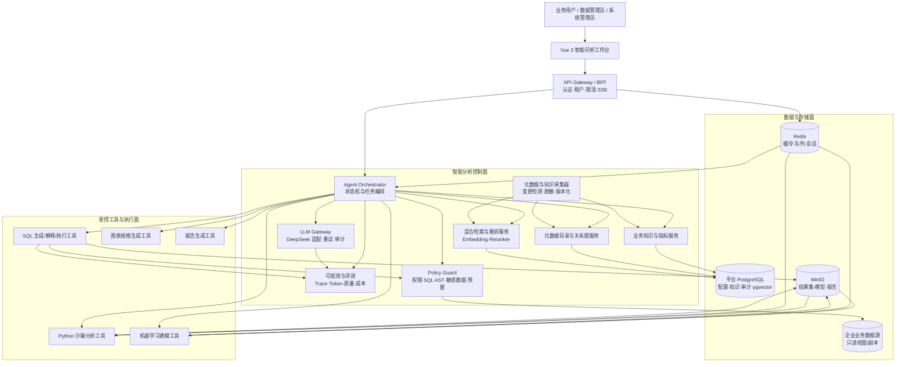
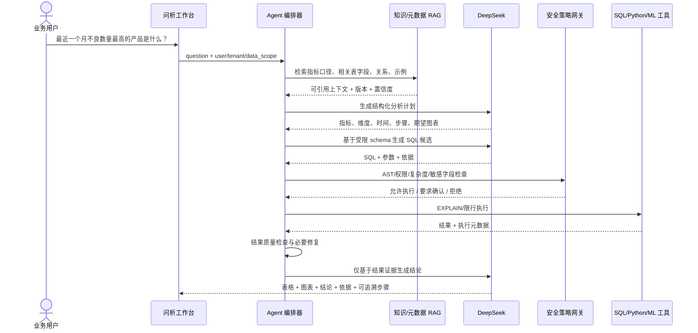
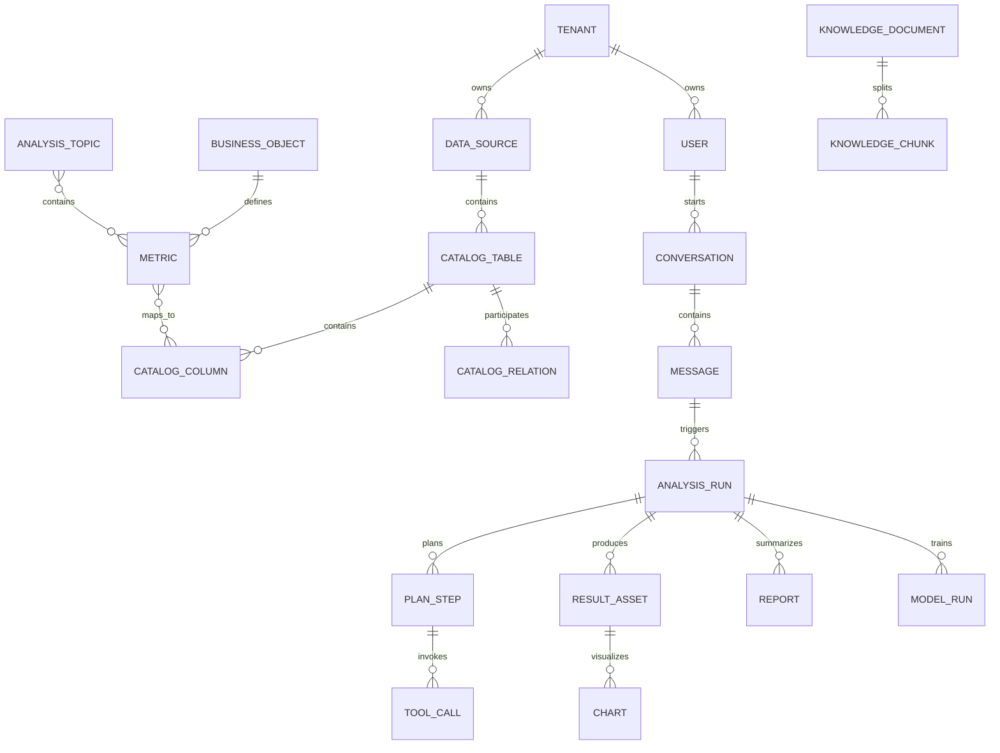
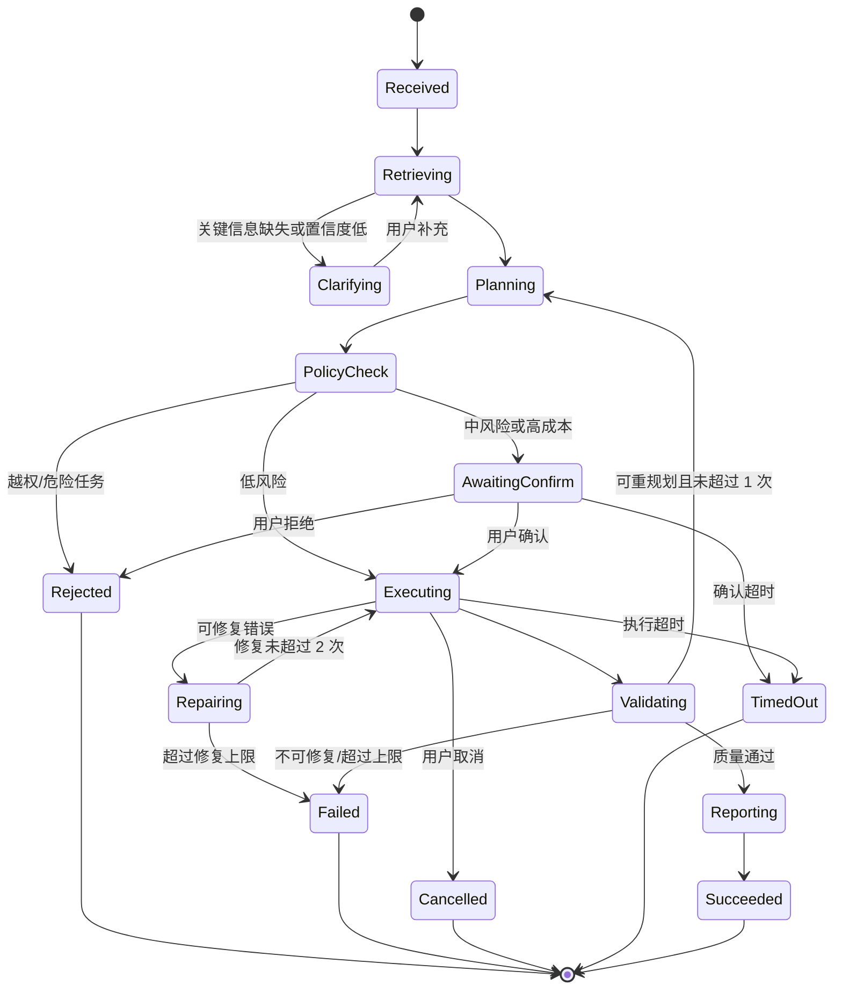
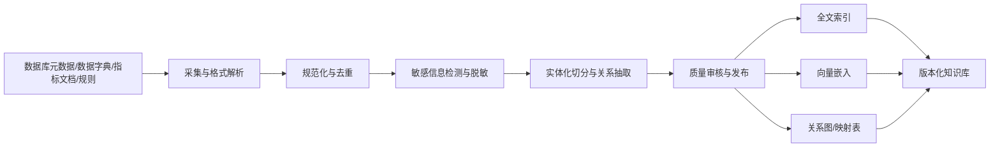

# A07《企业数据底座智能问析 Agent 系统》总体设计方案

| 项目 | 内容 |
|---|---|
| 文档类型 | 企业级软件项目总体设计文档（不含代码） |
| 赛题 | 2026“数字马力杯”第十三届浙江省大学生服务外包创新应用大赛 A07 |
| 命题单位 | 杭州自动化技术研究院 |
| 文档版本 | V1.0 |
| 编制日期 | 2026-08-23 |
| 目标读者 | 项目组、指导教师、评审专家、产品与技术负责人 |

---

## 1. 文档概述

### 1.1 建设目标

本项目建设一个面向制造企业数据底座的智能问析 Agent 平台。业务人员以自然语言提出生产、质量、设备、库存等问题，系统自动完成业务语义理解、数据资源定位、分析计划生成、SQL/脚本生成、安全执行、统计或机器学习分析、可视化以及报告生成，形成：

> 用户提问 → 业务与数据理解 → 智能规划 → 受控执行 → 结果校验 → 图表与结论 → 全程可追溯

系统的核心不是“让大模型直接回答数据问题”，而是让大模型作为分析任务的规划者和解释者，通过受控工具访问企业数据，并用可验证的数据证据生成结论。

### 1.2 产品定位

产品定位为“企业数据底座之上的智能分析入口”，重点解决三层鸿沟：

1. **业务语言与数据语言的鸿沟**：把“良率、停机、缺陷、趋势”等业务表达映射到表、字段、关系和指标口径。
2. **自然语言与分析执行的鸿沟**：把问题转化为可检查的分析计划、SQL、Python 或机器学习任务。
3. **分析结果与管理决策的鸿沟**：把结果组织成图表、结论、异常说明和简要报告，同时保留证据链。

### 1.3 赛题要求映射

本设计以《赛题手册》A07 章节（第 21—25 页）为需求基线。

| 赛题要求/评分点 | 系统能力 | 主要验收证据 |
|---|---|---|
| 业务知识组织 | 业务对象、指标、规则、主题、同义词管理 | 知识管理页面、指标口径版本 |
| 数据资源理解 | 元数据采集、字段说明、样例值、血缘与关系图 | 数据目录、表关系图、字段检索 |
| 自然语言分析 | 意图识别、澄清、任务规划、多轮分析 | 典型问题集与执行轨迹 |
| SQL/代码生成 | NL2SQL、Python 分析、代码查看与即席执行 | SQL/代码、校验记录、结果 |
| 建模能力 | 回归、分类、聚类、异常检测及解释 | 训练配置、指标、图表、解释 |
| Agent 闭环 | 规划、工具调用、结果校验、失败恢复、报告 | 可视化执行步骤和审计链 |
| 系统展示效果 | 表格、ECharts 图表、摘要、周/月报 | 交互演示与导出报告 |
| 工程可用性 | 权限、安全、异常处理、监控、测试 | 部署文档、告警、测试报告 |
| 应用价值 | 生产、质量、设备、库存四类制造场景 | 端到端业务演示脚本 |

### 1.4 范围与边界

**首期范围**：

- 制造业生产、质量、设备、库存四个分析主题；
- PostgreSQL/MySQL 两类连接器的元数据接入；首期单次分析任务只访问一个逻辑数据源，跨源联邦查询列为后续能力；
- 自然语言查询、指标分析、异常分析、相关性分析和报告生成；
- SQL 与 Python 受控执行；
- 线性回归、逻辑回归、决策树、随机森林、KMeans、Isolation Forest；
- 分析过程、数据依据、代码、图表和报告的统一展示。

**首期不做**：

- 不允许 Agent 修改源业务数据；
- 不训练通用基础大模型；
- 不把全部企业明细数据向量化；
- 不承诺替代专业 BI、数据仓库或 MLOps 平台；
- 不在无人工确认的情况下执行高风险、长耗时或大范围查询。

### 1.5 创新点与业务价值

| 企业痛点 | Agent/大模型作用 | 确定性系统保障 | 可验收价值 |
|---|---|---|---|
| 业务人员找不到表和字段 | 理解业务表达、识别对象/指标/维度 | 元数据目录、关系图、权限过滤 | 表字段 Recall@10、资源定位时间 |
| 指标口径依赖人工沟通 | 理解同义词并提出澄清 | 指标 DSL、版本和负责人 | 治理指标一致率、歧义澄清率 |
| SQL/分析依赖工程师 | 生成计划、SQL 和分析配方 | AST、只读账号、预算和沙箱 | 自助完成率、端到端耗时 |
| 报告整理重复且结论难追溯 | 生成图表说明和报告草稿 | 结果校验、证据引用、审计链 | 报告生成时间、有据结论率 |

项目启动第 1 周记录人工基线，例如“提出需求到获得首版结果”的中位耗时；最终以同一问题集对比 Agent 的完成时间、自助完成率和人工复核次数。建议竞赛目标为：典型问题由小时级/天级缩短到分钟级，至少 80% 的金标问题无需数据工程师编写 SQL 即可得到可复核首版结果。该目标只对规定演示数据与测试集负责。

---

## 2. 系统架构设计

### 2.1 架构原则

1. **模型规划、工具执行**：LLM 不直接连接数据库，不直接运行代码。
2. **语义先行、指标受控**：已治理指标优先于临时计算，避免同名异义和口径漂移。
3. **默认只读、最小权限**：源数据账号只授予允许查询的 schema/view。
4. **先校验后执行**：SQL AST、表字段权限、复杂度、行数、超时和敏感字段均需通过策略网关。
5. **结论有据、过程可见**：答案必须关联数据源、SQL/脚本、结果快照和知识版本。
6. **失败可恢复**：检索不足先澄清，SQL 失败有限次修复，禁止无限 Agent 循环。
7. **模型可替换**：通过统一 LLM Gateway 解耦 DeepSeek 与业务代码。

### 2.2 总体逻辑架构



### 2.3 部署架构

开发与比赛演示采用 Docker Compose 单机部署；企业化扩展采用 Kubernetes。逻辑组件保持一致：

- `web`：前端静态资源与 Nginx；
- `api`：同步 API、鉴权、SSE 推送；
- `agent-worker`：Agent 长任务编排；
- `analysis-worker`：隔离执行 Python/ML 任务；
- `postgres`：平台控制库和 pgvector；
- `redis`：任务队列、短期缓存、分布式锁；
- `minio`：大结果、模型、图表导出、报告文件；
- `otel-collector + prometheus + grafana`：链路、指标与仪表盘。

源业务库独立部署，平台使用只读账号或只读副本访问。生产环境的 Python 执行任务应运行在一次性容器中，关闭外网、限制 CPU/内存/磁盘/时长并在任务结束后销毁。

### 2.4 端到端业务流程



### 2.5 核心接口与事件契约

| 接口 | 用途 | 关键约束 |
|---|---|---|
| `POST /api/v1/analysis-runs` | 创建问析任务 | 接受幂等键，返回 `run_id/trace_id` |
| `GET /api/v1/analysis-runs/{id}` | 获取状态、计划、结果摘要 | 按租户和数据范围鉴权 |
| `GET /api/v1/analysis-runs/{id}/events` | SSE 订阅增量状态 | 支持 `Last-Event-ID` 断线续传 |
| `POST /api/v1/analysis-runs/{id}/confirm` | 确认中风险/高成本步骤 | 校验确认人权限和任务版本 |
| `POST /api/v1/analysis-runs/{id}/cancel` | 取消运行 | 向 SQL/Worker 传播取消信号 |
| `GET /api/v1/catalog/search` | 检索表、字段和关系 | 权限过滤早于返回 |
| `GET/POST /api/v1/knowledge/*` | 查询/维护对象、指标、规则、主题 | 版本化、审核后发布 |

SSE 事件统一包含 `event_id/run_id/trace_id/type/step_id/status/timestamp/payload_summary`；类型包括 `run.status_changed`、`plan.created`、`tool.started`、`tool.completed`、`confirmation.required`、`result.preview_ready`、`chart.ready`、`report.ready` 和 `run.terminal`。敏感工具参数不进入事件正文。领域对象 `EvidenceBundle`、`AnalysisPlan`、`SqlCandidate`、`PolicyDecision`、`ChartSpec` 使用版本化 JSON Schema；生产者与消费者在 CI 中执行契约测试。

---

## 3. 技术选型说明

### 3.1 推荐技术栈

| 层次 | 选型 | 选择理由 |
|---|---|---|
| 前端 | Vue 3 + TypeScript + Vite | 国内团队学习与交付成本低，组件生态成熟 |
| UI/状态 | Element Plus + Pinia + Vue Router | 适合企业后台、知识管理和数据目录界面 |
| 图表 | Apache ECharts | 制造业常用图表丰富，支持联动、导出与大屏 |
| API | Python 3.12 + FastAPI + Pydantic | 与 LLM、数据分析、机器学习生态一致，类型契约清晰 |
| ORM/迁移 | SQLAlchemy 2 + Alembic | 支持 PostgreSQL/MySQL，数据库版本可管理 |
| Agent 编排 | LangGraph（外层封装领域状态与节点接口） | 支持带状态、分支、重试、人机确认；避免自由循环，并保留后续替换编排框架的边界 |
| 异步任务 | Celery + Redis | 支持长查询、建模、报告任务、重试与任务状态 |
| LLM | DeepSeek API，统一 Gateway 封装 | 国内模型、OpenAI 兼容接口、支持工具调用与 JSON 输出 |
| 关系数据库 | PostgreSQL 16+ | 同时承载事务、JSONB、全文检索与平台配置 |
| 向量检索 | pgvector | 原型期降低组件数量，支持 HNSW 与租户过滤 |
| 对象存储 | MinIO | 存储大结果集、图片、报告与模型文件，数据库仅存 URI |
| SQL 安全 | SQLGlot + 数据库 EXPLAIN | 方言解析、AST 白名单、表字段级校验和成本预估 |
| 数据处理 | Polars/Pandas + NumPy | Polars 用于高效处理，Pandas 用于生态兼容 |
| 统计与 ML | SciPy + statsmodels + scikit-learn | 覆盖相关性、回归、分类、聚类和异常检测 |
| 可观测性 | OpenTelemetry + Prometheus + Grafana + Loki | 统一请求、Agent、工具、模型调用的链路与指标 |
| 测试 | Pytest + Vitest + Playwright | 覆盖单元、契约、端到端和浏览器交互 |
| 交付 | Docker Compose；可扩展 Kubernetes | 比赛演示易部署，企业环境可横向扩展 |

### 3.2 关键选型决策

**选择 PostgreSQL + pgvector，而非首期引入独立向量库**：A07 的知识量和元数据量有限，关系过滤、全文检索、向量检索可在一个数据库中完成，部署简单且容易演示。数据量或 QPS 显著增长后，可把向量检索替换为 Milvus/OpenSearch，接口层不变。

**选择 Python 主后端**：赛题同时要求 LLM、SQL、脚本和机器学习。Python 能减少 Java 服务与 Python 分析服务之间的跨语言复杂度。若团队已有 Java 企业底座，可采用 Java 管理面 + Python Agent/分析微服务，但比赛原型不建议增加此成本。

**采用受控状态机而非开放式多 Agent 群聊**：分析任务需要确定性、审计和失败边界。多个“专业角色”应作为可观测节点协作，共享结构化状态，而不是让多个模型无限对话。首期以 LangGraph 实现，但状态、节点和工具契约属于本项目领域层，不让业务代码直接耦合框架对象。

---

## 4. 前后端目录结构

建议采用 Monorepo，前端、API、Worker、契约、提示词、基础设施与文档统一版本管理。

```text
a07-data-agent/
├─ apps/
│  └─ web/                         # Vue 3 前端
│     ├─ src/
│     │  ├─ api/                   # API 与 SSE 客户端
│     │  ├─ assets/
│     │  ├─ components/
│     │  │  ├─ agent-trace/        # Agent 步骤、工具与状态展示
│     │  │  ├─ charts/             # ECharts 通用图表
│     │  │  ├─ data-grid/
│     │  │  └─ knowledge-graph/
│     │  ├─ layouts/
│     │  ├─ pages/
│     │  │  ├─ analysis/           # 问析会话、结果与报告
│     │  │  ├─ catalog/            # 数据表、字段、关系、样例值
│     │  │  ├─ knowledge/          # 对象、指标、规则、主题
│     │  │  ├─ models/             # 建模任务和评估
│     │  │  ├─ evaluation/         # 测试集和质量看板
│     │  │  └─ admin/              # 数据源、权限、提示词、审计
│     │  ├─ router/
│     │  ├─ stores/
│     │  ├─ types/
│     │  └─ utils/
│     └─ tests/
├─ services/
│  ├─ api/                         # FastAPI 同步接口层
│  │  └─ app/
│  │     ├─ api/v1/
│  │     ├─ core/                  # 配置、鉴权、租户、异常
│  │     ├─ db/                    # Session、模型、迁移适配
│  │     ├─ modules/
│  │     │  ├─ iam/
│  │     │  ├─ catalog/
│  │     │  ├─ knowledge/
│  │     │  ├─ conversations/
│  │     │  ├─ analysis/
│  │     │  ├─ models/
│  │     │  └─ audit/
│  │     └─ main.py
│  ├─ agent-worker/                # Agent 图与长任务
│  │  └─ app/
│  │     ├─ graph/                 # 状态、节点、路由、检查点
│  │     ├─ agents/                # 意图/SQL/分析/报告角色
│  │     ├─ tools/                 # 工具定义与调用适配
│  │     ├─ rag/                   # 检索、重排、上下文构建
│  │     ├─ llm/                   # DeepSeek Gateway
│  │     ├─ guards/                # SQL/代码/数据/成本策略
│  │     ├─ prompts/               # 版本化提示词
│  │     └─ evaluation/
│  └─ analysis-worker/             # 隔离的数据科学执行服务
│     └─ app/
│        ├─ sandbox/
│        ├─ sql/
│        ├─ dataframe/
│        ├─ ml/
│        ├─ chart/
│        └─ report/
├─ packages/
│  ├─ contracts/                   # OpenAPI、JSON Schema、事件定义
│  ├─ domain/                      # 指标、分析计划等共享领域模型
│  └─ prompt-templates/            # 跨服务提示词模板和版本说明
├─ data/
│  ├─ demo/                        # 脱敏演示数据
│  ├─ metadata/                    # 数据字典、关系与指标口径
│  ├─ knowledge/                   # 制造业务知识
│  └─ evaluation/                  # 标准问题与期望结果
├─ infra/
│  ├─ compose/
│  ├─ kubernetes/
│  ├─ nginx/
│  ├─ observability/
│  └─ database/
├─ docs/
│  ├─ architecture/
│  ├─ api/
│  ├─ business-knowledge/
│  ├─ data-resources/
│  ├─ user-guide/
│  └─ team-process/
├─ tests/
│  ├─ contract/
│  ├─ integration/
│  ├─ e2e/
│  ├─ security/
│  └─ llm-evals/
├─ scripts/                        # 初始化、采集、评测、演示脚本
└─ README.md
```

目录中的 `prompts` 不是散落字符串，而是带 `prompt_key/version/model/schema/test_set` 的版本化资产；`contracts` 中的 JSON Schema 是 Agent 与工具之间的唯一接口依据。

---

## 5. 数据库设计方案

### 5.1 数据分层

1. **企业业务数据源**：ERP/MES/QMS/EAM/WMS 数据或比赛样例库，只读访问。
2. **平台控制库**：用户、数据源、元数据、知识、会话、Agent 运行、审计。
3. **向量与全文索引**：存于平台 PostgreSQL 的 `pgvector + tsvector`。
4. **对象存储**：大结果集、报告、图表图片、训练模型；数据库只记录 URI、哈希和权限。

严禁将源数据库密码、完整敏感样例或大批明细数据写入知识向量库。

### 5.2 平台库核心表

平台控制库中的租户域表统一包含 `id`、`tenant_id`、`created_at`、`updated_at`；这不要求改造外部 ERP/MES 源表。知识类表额外包含 `version`、`status`、`owner_id`、`valid_from`、`valid_to`。核心自然键采用租户内唯一约束，例如 `unique(tenant_id, metric_code, version)`；对外引用采用不可枚举 ID，删除默认使用状态失效，审计与运行记录不做软删除覆盖。

| 领域 | 核心表 | 关键字段与用途 |
|---|---|---|
| 租户权限 | `tenants`、`users`、`roles`、`user_roles`、`data_scopes` | 租户、RBAC、数据源/schema/行列范围 |
| 数据源 | `data_sources` | 类型、连接密文引用、只读状态、健康状态 |
| 元数据 | `catalog_tables`、`catalog_columns`、`catalog_relations`、`sample_values` | 表字段、主外键/推断关系、脱敏样例、统计信息 |
| 业务知识 | `business_objects`、`metrics`、`metric_dimensions`、`business_rules`、`analysis_topics`、`synonyms` | 对象、指标公式、维度、规则、主题和术语 |
| 知识 RAG | `knowledge_documents`、`knowledge_chunks` | 来源、版本、文本、embedding、权限标签、引用锚点 |
| 会话 | `conversations`、`messages` | 多轮上下文、用户反馈、最终回答 |
| Agent 运行 | `analysis_runs`、`plan_steps`、`tool_calls`、`run_events` | 状态机快照、步骤、工具输入输出摘要、SSE 事件 |
| 分析资产 | `sql_artifacts`、`code_artifacts`、`result_assets`、`charts`、`reports` | SQL/代码、结果 URI、图表规格、报告版本 |
| 建模 | `model_runs`、`model_metrics`、`model_artifacts` | 特征、数据快照、算法、参数、指标和模型 URI |
| 治理 | `prompt_versions`、`policy_rules`、`audit_logs`、`evaluation_cases`、`evaluation_runs` | 提示词、策略、审计、回归测试 |

### 5.3 关键表字段建议

**`metrics` 指标定义表**

- `metric_code`：稳定唯一编码，如 `QUALITY_YIELD_RATE`；
- `name`、`aliases`：中文名和同义词；
- `formula_expression`：受限表达式，不存任意可执行代码；
- `numerator_definition`、`denominator_definition`；
- `base_table_id`、`time_column_id`；
- `default_dimensions`、`allowed_filters`（JSONB）；
- `unit`、`precision`、`null_policy`、`owner_id`；
- `version`、`status`、`valid_from/valid_to`。

**`analysis_runs` 分析运行表**

- `conversation_id`、`message_id`、`user_id`；
- `intent_type`、`risk_level`；
- `status`：`received/retrieving/planning/awaiting_confirm/executing/validating/reporting/succeeded/failed/cancelled`；
- `knowledge_snapshot`、`catalog_snapshot`、`prompt_version`、`model_name`；
- `started_at`、`finished_at`、`latency_ms`、`token_usage`、`cost_estimate`；
- `error_code`、`error_summary`、`trace_id`。

**`tool_calls` 工具调用表**

- `run_id`、`step_id`、`tool_name`、`tool_version`；
- `request_json`（敏感字段脱敏）、`request_hash`；
- `response_summary`、`result_asset_id`；
- `policy_decision`、`started_at`、`finished_at`、`status`。

### 5.4 指标 DSL 与安全编译

`formula_expression` 使用受限指标 DSL，而不是自由 SQL。DSL 只允许：已登记度量、`SUM/COUNT/COUNT_DISTINCT/AVG/MIN/MAX`、四则运算、条件聚合和安全除法。解析器将 DSL 编译为 AST，再依据指标绑定生成目标方言 SQL。

编译前必须验证：

1. 请求维度是否在指标允许维度内，字段是否能通过登记关系连接；
2. 时间粒度是否符合日/周/月下钻与汇总规则；
3. 比率指标必须先分别聚合分子、分母再相除，禁止直接平均明细比率；
4. 除零、空值、去重键、时区和自然周定义是否采用指标版本规定；
5. 跨表指标只能沿审核通过的连接路径编译，禁止模型临时猜测连接键；
6. 编译产物仍需进入统一 SQL Policy Guard。

模型负责把用户语言映射为 `metric_code + dimensions + filters + grain`，确定性指标编译器负责生成计算 SQL，从根本上降低指标口径幻觉。

### 5.5 关系模型



### 5.6 演示业务数据模型

建议准备星型模型与贴源表并存的演示数据，覆盖赛题给出的典型资源：

| 主题 | 建议表 | 关键字段 |
|---|---|---|
| 主数据 | `dim_product`、`dim_process`、`dim_line`、`dim_equipment`、`dim_date` | 产品、工序、产线、设备、日期 |
| 生产 | `fact_work_order`、`fact_process_output` | 工单、计划/实际数量、合格数、报废数、工序时间 |
| 质量 | `fact_quality_inspection`、`fact_quality_defect` | 检验数、不良数、缺陷类型、结果、产品/批次 |
| 设备 | `fact_equipment_downtime`、`fact_equipment_alarm` | 停机起止、持续时长、原因、报警次数 |
| 库存 | `fact_inventory_snapshot`、`fact_inventory_movement` | 库存量、安全库存、出入库、库龄 |

首批治理指标：产量、计划达成率、工序良率、不良率、不良数量、停机时长、故障次数、库存量、库存周转天数。每个指标必须明确公式、时间字段、粒度、空值规则、适用维度和责任人。

### 5.7 索引、隔离与生命周期

- 业务唯一键、外键、时间列建立 B-Tree；名称检索可用 `pg_trgm`；
- `knowledge_chunks.embedding` 建 HNSW cosine 索引，`content_tsv` 建 GIN；
- 所有检索先过滤 `tenant_id + security_tags + status`，再进行相似度计算；
- 审计日志追加写，重要记录保留哈希；
- 对话与结果按租户配置保留期，过期结果从 MinIO 与数据库同步清理；
- 源数据结果默认不长期保存，仅保存必要摘要或加密快照。

外部 PostgreSQL/MySQL 的行列权限不依赖 LLM 或单一 SQL 重写。优先在数据源侧提供按角色划分的安全视图和专用只读账号；平台再叠加目录级授权、列脱敏、查询范围检查和结果过滤。PostgreSQL 可选 RLS 作为附加防线，MySQL 采用安全视图/账号授权。SQLGlot/AST 是应用层校验器，不替代数据库只读权限、网络隔离、资源限制和审计。

---

## 6. Agent 架构设计

### 6.1 设计模式

采用“单编排器 + 多专业节点 + 工具总线 + 质量闸门”的有界 Agent 架构。角色是职责边界，不必为每个角色发起独立大模型调用；简单问题可走快速路径，复杂问题才进入完整规划与建模路径。

### 6.2 专业节点

| 节点 | 职责 | 主要输出 |
|---|---|---|
| 意图与澄清 Agent | 识别查询、指标、对比、趋势、异常、相关性、建模、报告；补齐时间/对象/口径 | `IntentResult`、澄清问题 |
| 知识与数据检索 Agent | 检索指标、规则、表字段、关系、样例和已验证案例 | `EvidenceBundle` |
| 分析规划 Agent | 将需求拆成数据、计算、校验、图表和报告步骤 | `AnalysisPlan` |
| SQL Agent | 基于允许的 schema 和指标表达式生成参数化只读 SQL | `SqlCandidate` |
| 数据科学 Agent | 生成受限分析配方，选择统计/ML 算法与评估方式 | `AnalysisRecipe` |
| 可视化 Agent | 按字段类型和分析目的生成 ECharts 规格 | `ChartSpec` |
| 结论报告 Agent | 仅依据执行结果和统计证据生成摘要、发现、限制 | `InsightReport` |
| LLM 质量审核节点 | 检查结论是否充分、有无夸大或遗漏，仅提供质量建议，无执行放行权 | `ReviewSuggestion` |
| 确定性 Policy Guard | 用代码和策略检查权限、SQL AST、敏感字段、资源预算；拥有唯一执行放行权 | `PolicyDecision` |

### 6.3 Agent 状态机



所有非终态均写入检查点。服务重启后由任务恢复器将可恢复任务重新入队；等待确认任务继续等待至截止时间。单次运行硬限制为：SQL 修复最多 2 次、全局重规划最多 1 次、工具步骤最多 12 个、总墙钟时间默认 15 分钟。达到任一限制即进入 `failed` 或 `timed_out`，不得由 LLM 自行放宽。

### 6.4 共享状态对象

`AgentState` 至少包含：

- 用户、租户、角色、可访问数据范围；
- 原始问题、标准化问题、会话上下文；
- 识别出的业务对象、指标、维度、过滤条件、时间范围；
- 检索证据及其来源、版本、置信度；
- 结构化分析计划与当前步骤；
- SQL/脚本/模型配方、策略检查结果；
- 执行结果摘要、数据质量检查、图表规格；
- 错误、修复次数、预算、Trace ID；
- 最终结论、限制、引用与用户反馈。

状态写入检查点存储，可在服务重启、人工确认或长任务完成后恢复。

### 6.5 工具设计

所有工具采用 JSON Schema 定义输入输出，模型只能“申请调用”，不能绕过工具直接执行。

| 工具 | 关键约束 |
|---|---|
| `search_business_knowledge` | 返回可引用的指标/规则版本与来源 |
| `search_catalog` | 只返回用户有权访问的表字段和脱敏样例 |
| `resolve_metric` | 优先精确命中治理指标，冲突时强制澄清 |
| `validate_sql` | 仅允许 SELECT/CTE；拦截 DDL/DML、危险函数、多语句 |
| `explain_sql` | 预估扫描量、连接方式和成本，超阈值需确认 |
| `execute_sql` | 参数化、只读事务、超时、限行、取消、脱敏 |
| `run_dataframe_recipe` | 只接受白名单操作配方，不直接接受任意源码 |
| `train_model` | 限定算法、特征、资源与评估；记录随机种子 |
| `render_chart` | 校验字段存在、类型匹配、采样与聚合规则 |
| `build_report` | 只能引用本次运行已验证的结果资产 |

### 6.6 SQL 与脚本安全

1. SQL 只允许单条 `SELECT` 或只读 CTE；禁止 DDL、DML、存储过程、跨库访问和注释绕过。
2. SQLGlot 解析 AST 后校验表/列白名单、租户与数据权限、函数白名单和方言。
3. 自动添加行数上限、语句超时、只读事务；执行前先做 `EXPLAIN`。
4. 星号查询、大表无时间过滤、笛卡尔积、深层子查询或高成本计划进入人工确认。
5. Python 优先执行结构化 Recipe；确需代码时在一次性沙箱中运行，关闭网络，限定包、文件路径和系统调用。
6. LLM 输出、SQL 参数和工具参数均做 Schema 校验；错误修复最多两次，之后明确失败原因并建议用户缩小范围。

脚本能力采用分级权限：

| 能力 | 普通业务用户 | 数据分析师 | 管理员 |
|---|---:|---:|---:|
| 查看系统生成的 SQL/Recipe | 允许 | 允许 | 允许 |
| 执行白名单 DataFrame/ML Recipe | 允许（受数据范围限制） | 允许 | 允许 |
| 查看系统生成的 Python 源码 | 默认隐藏，可授权 | 允许 | 允许 |
| 确认并执行生成的 Python 源码 | 不允许 | 人工确认后允许 | 按策略允许 |
| 修改后执行源码 | 不允许 | 独立权限 + 人工确认 | 独立权限 + 审计 |

源码沙箱以一次性容器运行：非 root、只读根文件系统、无外网、临时工作目录、包白名单、CPU/内存/PID/磁盘/时长配额；输入只通过结果资产 ID 挂载，输出只写指定目录。比赛演示环境若无法提供强隔离，则关闭“任意源码执行”，仅开放结构化 Recipe。

### 6.7 结果可信机制

- **口径可信**：指标答案展示指标名称、版本、公式和筛选条件；
- **数据可信**：展示数据源、表字段、数据时间范围、记录数和更新时间；
- **执行可信**：用户可查看 SQL/分析配方、耗时和质量检查；
- **结论可信**：每条重要结论关联图表或结果单元，禁止无数据支持的因果表述；
- **不确定性透明**：区分“数据事实、统计关联、模型预测、业务建议”；
- **可复现**：保存查询参数、知识/目录快照版本、模型版本、随机种子和结果哈希。

---

## 7. DeepSeek 调用方案

### 7.1 调用架构

业务服务不直接依赖具体模型 SDK，统一通过 `LLM Gateway`：

```text
Agent Node → LLM Gateway → Prompt Registry → DeepSeek Adapter → DeepSeek API
                         ↘ Schema Validator / Retry / Metrics / Audit
```

Gateway 提供 `plan()`、`generate_sql()`、`select_tool()`、`explain_result()`、`generate_report()` 等领域接口；底层模型名称、思考模式、超时和回退策略全部配置化。

### 7.2 模型路由

截至 2026-08-23 访问 DeepSeek 官方文档时，Chat Completions 页面列出 `deepseek-v4-flash` 与 `deepseek-v4-pro`。模型 ID 和功能状态属于外部可变配置，不在业务代码中硬编码；部署前必须用项目账号执行“模型列表/最小对话/JSON 输出/工具调用/流式响应”冒烟测试，能力探测通过后才启用对应路由。未通过时回退到已验证模型或备用供应商适配器。

| 场景 | 推荐路由 | 说明 |
|---|---|---|
| 意图分类、改写、简单摘要 | Flash + 非思考模式 | 低延迟、低成本 |
| 分析计划、复杂 NL2SQL、错误修复 | Pro + 思考模式 | 强化复杂约束推理 |
| 最终报告 | Pro；有充足结构化证据后调用 | 重视一致性与表达 |
| 服务异常 | 同模型有限重试 → 备用模型适配器 | 避免无限重试和雪崩 |

### 7.3 结构化输出与工具调用

- 分析计划、SQL 候选、图表建议均要求 JSON Schema；
- 使用 JSON Output 时，提示词中明确要求 JSON 并给出结构示例，同时为完整 JSON 预留足够输出长度；
- 工具参数必须在本地再次校验，不因模型输出格式正确就直接执行；
- Strict Tool Calls 属于 Beta 能力时，必须通过功能开关启用，不能成为系统唯一可靠性保障；
- 思考模式的多轮工具调用应按官方协议正确回传所需的 `reasoning_content`，但不向终端用户展示或当作业务审计结论；
- UI 展示的是系统生成的“步骤摘要、工具调用和执行证据”，不是模型隐藏推理内容。

### 7.4 提示词分层

每次请求按稳定顺序构建：

1. 系统角色与不可突破的安全规则；
2. 当前工具定义与结构化输出 Schema；
3. 租户、用户权限和数据范围；
4. 版本化业务指标、规则和元数据证据；
5. 会话必要摘要；
6. 当前用户问题与步骤目标。

静态、稳定内容放在前缀，动态问题放在末尾，以提高上下文缓存命中；响应记录 `prompt_cache_hit_tokens` 与 `prompt_cache_miss_tokens` 用于成本分析。

### 7.5 数据最小化与安全

- API Key 仅保存在服务端 Secret Manager/环境密钥中，前端不可见；
- 默认仅向模型发送元数据、脱敏样例、Top-K 知识和聚合后的结果摘要；
- 不发送连接串、个人身份信息、商业机密明细和无关全表数据；
- `user_id` 使用不可逆内部标识，不包含姓名、手机号等隐私信息；
- 请求和响应日志进行敏感字段遮蔽，正文按需留存；
- 企业私有化场景可将 Gateway 切换到兼容接口的本地模型服务。

### 7.6 稳定性、成本与观测

- 前端采用 SSE 流式显示任务状态；模型输出可流式，工具执行状态通过事件流独立推送；
- 对 429、500、503 使用指数退避和随机抖动；400/401/402/422 不盲目重试；
- 为意图、规划、SQL、报告分别设置独立超时、最大 Token 和并发舱壁；
- 请求携带幂等键，避免重试重复创建任务；
- 记录模型、提示词版本、首 Token 延迟、总延迟、Token、缓存命中、工具成功率和估算成本；
- 达到单请求预算、总步骤数或总时长上限后终止，并返回已完成步骤与可操作建议。

官方接口依据：

- [DeepSeek Chat Completions](https://api-docs.deepseek.com/api/create-chat-completion)
- [DeepSeek Tool Calls](https://api-docs.deepseek.com/guides/tool_calls)
- [DeepSeek Thinking Mode](https://api-docs.deepseek.com/guides/thinking_mode)
- [DeepSeek JSON Output](https://api-docs.deepseek.com/guides/json_mode)
- [DeepSeek Context Caching](https://api-docs.deepseek.com/guides/kv_cache)
- [DeepSeek Error Codes](https://api-docs.deepseek.com/quick_start/error_codes/)

上述页面访问日期均为 2026-08-23；本文未持有项目 API Key，因此设计阶段只核验公开接口文档，实际可用型号、配额和计费以联调环境冒烟测试及项目账号控制台为准。

---

## 8. RAG 方案

### 8.1 RAG 的目标

本项目的 RAG 不是单一文档问答，而是“三路检索 + 图关系扩展”的企业语义检索：

1. **业务知识 RAG**：对象、指标、规则、主题、术语、分析说明；
2. **数据目录 RAG**：表、字段、说明、样例、主外键、时间列、数据质量；
3. **验证案例 RAG**：人工审核通过的问题—计划—SQL 模板；
4. **关系图扩展**：从命中指标/表沿指标映射和表关系补齐可连接资源。

原始事实数据继续由 SQL 查询，不进入 RAG；RAG 负责“找到怎样查、口径是什么”，数据库负责“事实是多少”。

### 8.2 知识入库流程



切分策略按实体类型区分：

- 指标、规则：一条定义为一个完整知识单元，不跨口径切分；
- 表：表说明 + 主题 + 关键字段作为一个实体，字段另设子实体；
- 文档：按标题层级切分，建议 400—800 个中文字符并保留父标题；
- SQL 案例：仅入库人工验证通过、绑定方言和 schema 版本的模板。

Embedding 推荐使用可私有化的中文/多语种模型（如 BGE-M3 类模型），重排使用独立 reranker；通过接口抽象保留替换能力。嵌入模型版本写入每条 chunk，模型升级采用新索引并行重建。

中文关键词检索不直接依赖 PostgreSQL 默认分词。比赛版采用“规范化名称/别名精确匹配 + `pg_trgm` 字符 n-gram 模糊检索 + 向量检索 + reranker”；企业版知识规模扩大后，可切换到配置中文分词器的 OpenSearch。向量检索先做租户/安全标签过滤，并采用过采样后重排；若权限过滤导致召回下降，则按租户/业务域分区索引。

### 8.3 在线检索流程

1. 对问题进行规范化，识别对象、指标、维度、时间、比较和分析类型；
2. 指标编码、名称、别名和业务术语进行精确匹配；
3. 对业务知识和数据目录并行执行全文检索与向量检索；
4. 按表关系、指标映射、主题关系扩展一跳资源；
5. 结合权限、有效版本、来源可信度、关键词分数、向量分数进行融合；
6. 使用 reranker 重排；
7. 构建有 Token 预算的 `EvidenceBundle`，保留来源 ID、版本和置信度；
8. 若指标冲突、时间字段不明确或证据低于阈值，进入澄清而不是猜测。

建议融合评分：`exact_match > governed_metric > verified_example > lexical/vector > graph_expansion`。指标治理记录必须高于相似文本。

### 8.4 增量更新与回滚

- 采集器按数据源保存 schema 指纹，新增/修改/删除表字段生成变更事件；
- 受影响的目录实体、关系、知识 chunk 和验证 SQL 被标记为 `pending_review` 或 `stale`；
- 指标与业务规则由数据管理员审核后发布，禁止采集任务自动覆盖已治理口径；
- Embedding 使用蓝绿索引：新模型写入新版本，完成校验后切换别名，失败可回滚旧索引；
- 发布事件使 RAG 缓存、上下文缓存和表关系缓存按租户/资产 ID 精确失效；
- 已完成的分析运行继续引用原快照，新运行只使用当前有效版本。

### 8.5 上下文包结构

传给分析规划和 SQL Agent 的内容不是大段拼接文本，而是结构化证据包：

- `business_entities`：业务对象、别名、定义；
- `metrics`：公式、单位、粒度、空值规则、允许维度、版本；
- `tables`：表名、说明、主题、数据规模、更新时间；
- `columns`：类型、说明、脱敏样例、敏感等级；
- `joins`：左右表、连接键、基数、可信来源；
- `rules`：业务规则和适用条件；
- `verified_examples`：问题模式、SQL 模板、适用 schema 版本；
- `citations`：来源、锚点、版本、负责人。

### 8.6 RAG 质量评估

建立独立测试集，至少覆盖 100 个术语/问题表达和 30 个端到端分析问题：

| 指标 | 建议目标 |
|---|---:|
| 指标定义精确命中率 | 100%（固定已发布治理指标集） |
| 表/字段 Recall@10 | ≥ 95% |
| 关系路径正确率 | ≥ 90% |
| MRR | ≥ 0.85 |
| 低置信问题正确澄清率 | ≥ 90% |
| 过期知识进入上下文 | 0 |

---

## 9. 典型智能问析场景设计

### 9.1 生产趋势分析

问题：“统计每条产线最近 7 天的产量趋势，并找出下降最明显的产线。”

Agent 行为：解析时间与维度 → 命中产量指标 → 定位产量事实表、产线和日期维 → 生成聚合 SQL → 趋势斜率计算 → 折线图 → 输出下降产线及数据依据。

### 9.2 质量分析报告

问题：“生成本周质量分析结果。”

Agent 应主动确定或询问周定义、组织范围和对比基准，随后完成良率/不良率、缺陷 Pareto、产品/工序对比、环比变化、异常点和报告。报告中的“原因”必须标注为数据证据、相关线索或待核实假设。

### 9.3 设备与质量相关性

问题：“分析设备停机时间和不良率是否相关。”

Agent 行为：确认分析粒度 → 按设备/日期聚合并对齐数据 → 检查样本量、缺失值和异常值 → 计算 Pearson/Spearman → 绘制散点与趋势 → 给出相关系数、显著性、样本范围和“相关不代表因果”说明。

### 9.4 异常检测与建模

问题：“识别最近三个月产量异常的工序。”

Agent 行为：构建工序日粒度特征 → 检查样本量 → 选择规则阈值或 Isolation Forest → 记录参数与随机种子 → 输出异常分数、异常点和特征解释 → 允许用户调整灵敏度重新运行。

---

## 10. 非功能与安全设计

### 10.1 权限与数据安全

- OIDC/JWT 登录，RBAC 叠加数据范围控制；
- 数据源凭据集中密管、定期轮换；
- 列级敏感标签与输出脱敏；
- 租户隔离贯穿 API、数据库行级策略、缓存键、向量检索和对象存储路径；
- SQL 只读账号、IP 白名单和 TLS；
- 导出、查看 SQL、查看样例、运行模型等操作独立授权。

### 10.2 性能目标

| 场景 | 建议目标 |
|---|---:|
| 元数据/知识普通查询 P95 | ≤ 2 秒 |
| 简单问析首个状态反馈 | ≤ 1 秒 |
| 简单 SQL 问析端到端 P95 | ≤ 15 秒 |
| 复杂建模任务 | 异步执行，可取消，演示数据 ≤ 90 秒 |
| 单次 SQL 默认超时 | 30 秒，可按角色配置 |
| 页面可用性 | 核心演示流程无阻断错误 |

### 10.3 可观测性

每次问析生成统一 `trace_id`，串联浏览器请求、Agent 节点、RAG、DeepSeek、SQL、Python/ML、图表和报告。核心指标包括：

- 任务成功率、各状态耗时、澄清率、修复率、取消率；
- RAG 命中与用户采纳、NL2SQL 语法/执行/结果正确率；
- SQL 扫描量、超时、拦截原因；
- 模型延迟、Token、缓存命中和成本；
- 最终答案有据率、用户点赞/纠错、回归测试通过率。

### 10.4 容量、可用性与灾备基线

比赛版容量基线建议为：演示业务数据 100 万—500 万行、目录对象 1 万以内、知识 chunk 5 万以内、同时在线用户 20、并发问析 5、并发建模 2。以一台 8 vCPU/32 GB 内存主机运行 Compose，DeepSeek 使用远程 API；若自托管 Embedding/Reranker，根据模型大小另配 GPU 或采用 CPU 小模型并预计算索引。压测结论以实际比赛设备为准。

企业版采用多副本 API/Worker、托管 PostgreSQL 主备、Redis 高可用和对象存储多副本；跨可用区部署、每日全量加持续归档，建议控制库 `RPO ≤ 15 分钟、RTO ≤ 2 小时`。比赛 Compose 为单机原型，不宣称具备高可用。开发、测试、演示/生产环境独立，配置和密钥不跨环境复用；上线流程包含数据库迁移备份、灰度、回滚和故障演练。

### 10.5 机器学习治理

- 先判定任务类型、样本量、目标变量和评价指标，不适用时拒绝建模并解释原因；
- 时间相关任务按时间切分训练/验证集，其他任务采用分层或交叉验证，禁止用未来信息构造特征；
- 特征工程只在训练集拟合，流水线整体保存，避免标准化和缺失填补泄漏；
- 分类任务检查类别不平衡，聚类/异常检测展示参数敏感性；
- 记录数据快照、特征版本、算法版本、参数、随机种子、环境镜像和模型卡；
- 模型结果定位为辅助分析，未经业务验证不进入自动生产决策。

---

## 11. 项目开发路线规划

### 11.1 12 周路线图

| 阶段 | 周期 | 主要工作 | 里程碑/退出条件 |
|---|---|---|---|
| 0. 需求与样例基线 | 第 1 周 | 赛题拆解、用户故事、四大主题、样例表、30 个金标问题 | 需求矩阵、数据字典、演示故事确定 |
| 1. 工程底座 | 第 2—3 周 | Monorepo、登录权限、数据源配置、会话、任务、Docker、监控骨架 | 系统可部署，基础页面/API 可用 |
| 2. 知识与数据目录 | 第 4—5 周 | 元数据采集、业务对象/指标/规则、全文+向量检索、关系图 | 可查表字段、指标、样例和关系 |
| 3. Agent MVP | 第 6—7 周 | 意图、检索、规划、NL2SQL、校验、只读执行、表格/图表、Trace | 10 个核心问题端到端闭环 |
| 4. 高级问析与建模 | 第 8—9 周 | Python Recipe、统计分析、六类 ML、报告、异步任务 | 相关性、异常检测、报告场景可演示 |
| 5. 安全与质量加固 | 第 10 周 | SQL 攻击测试、沙箱、敏感脱敏、重试/取消、预算、回归评测 | 固定危险 SQL 攻击集拦截率 100%，无阻断缺陷 |
| 6. 竞赛交付 | 第 11—12 周 | UI 优化、演示数据、性能调优、PPT、视频、手册、分工记录、彩排 | 全材料齐备，连续演示三次成功 |

### 11.2 开发优先级

**P0（必须完成）**：业务知识、数据目录、自然语言问析、SQL 生成与查看、安全执行、图表、Agent 轨迹；稳定打通“指标查询、趋势分析、相关性分析、异常检测”四条主线，并以质量报告作为组合演示。

**P1（满足完整赛题并显著加分）**：表关系图、口径版本、澄清交互、六类算法的统一 Recipe 与评估、报告模板、审计与质量看板。答辩重点演示 Isolation Forest 与一种回归/分类模型，其余算法用自动化验收证明可用。

**P2（时间允许）**：跨数据源联邦分析、收藏复用、问析分享、知识反馈闭环、模型多供应商回退。

### 11.3 团队分工建议

| 角色 | 主要职责 |
|---|---|
| 产品/架构负责人 | 需求、总体架构、指标口径、集成、答辩故事 |
| Agent/后端负责人 | Agent 状态机、DeepSeek Gateway、RAG、API、安全策略 |
| 数据/算法负责人 | 样例数据、元数据、SQL、统计/ML、评测集 |
| 前端/交付负责人 | 问析工作台、目录/知识页面、图表、演示、PPT/视频/手册 |

若团队 3 人，可由产品/架构负责人兼任后端集成；所有成员都需提交周记录、设计决策和测试证据，以满足过程文档要求。

### 11.4 验收指标

| 类别 | 指标 | 目标 |
|---|---|---:|
| Agent 闭环 | 固定 30 个金标问题端到端完成率 | ≥ 85% |
| NL2SQL | 固定简单问题集执行正确率 | ≥ 90% |
| NL2SQL | 固定复杂问题集执行正确率 | ≥ 75% |
| 指标口径 | 已发布治理指标集计算一致率 | 100% |
| 安全 | 已定义 DDL/DML/越权/多语句攻击集拦截率 | 100% |
| 可追溯 | 测试集中成功问析具备证据链比例 | 100% |
| 工程 | 四条核心演示流程成功率 | 100%（规定环境连续三次） |
| 体验 | 已定义关键任务可见状态与可取消覆盖率 | 100% |

### 11.5 测试策略

- **单元测试**：指标表达式、权限规则、SQL AST、状态路由、图表规则；
- **契约测试**：Agent 节点与工具 JSON Schema、DeepSeek 适配器模拟响应；
- **数据测试**：主外键、空值、时间范围、指标基准结果；
- **LLM 评测**：意图、schema linking、计划、SQL、报告有据性；
- **安全测试**：提示词注入、越权查询、DDL/DML、资源耗尽、敏感信息泄露；
- **端到端测试**：四个主题的问析、澄清、失败修复、建模和报告；
- **演示回归**：断网/模型超时/空结果/错误问题等降级路径。

评测集需按简单、复杂连接、歧义、越权、空结果、脏数据、提示词注入和分布外问题分层；分别报告检索命中、语法有效、执行成功、业务语义正确、数值正确、结论有据与安全拦截，不能用“SQL 能运行”代替“答案正确”。百分比只代表版本化测试集结果，不代表开放环境绝对保证。

### 11.6 竞赛交付物对照

| 赛题提交材料 | 项目产物 |
|---|---|
| 项目概要介绍 | 一页项目简介、核心价值与架构图 |
| 项目简介 PPT | 痛点—方案—技术—演示—价值—展望 |
| 项目详细方案 | 本文档及数据库/API/安全补充设计 |
| 项目演示视频 | 3—5 分钟主线 + 典型问析场景 |
| 产品使用手册 | 角色、功能架构、流程图、操作与 FAQ |
| 产品交互演示 | 录制问析、查看 SQL、图表、报告、建模 |
| 分工及过程文档 | 周计划、任务看板、会议纪要、Git 记录 |
| 业务知识说明 | 对象、指标、规则、主题与版本表 |
| 数据资源说明 | 表、字段、关系、样例、脱敏与数据质量 |

---

## 12. 风险与应对

| 风险 | 影响 | 应对 |
|---|---|---|
| 指标口径含糊 | 答案看似合理但业务错误 | 指标治理优先，冲突强制澄清 |
| 未知表 schema linking 错误 | SQL 查错表/错字段 | 混合检索、关系扩展、候选解释、金标评测 |
| LLM 幻觉 SQL/参数 | 执行错误或安全风险 | Schema 约束、AST 白名单、权限网关、有限修复 |
| 查询扫描过大 | 数据库受压、演示卡顿 | EXPLAIN、时间过滤、限行、超时、异步与取消 |
| 相关性被解释为因果 | 决策误导 | 统计前提检查、措辞规则、报告审核 |
| DeepSeek 限流/服务波动 | 主流程不可用 | 退避、熔断、降级、缓存、可插拔备用模型 |
| 演示数据过于理想 | 缺少真实企业价值 | 注入缺失、异常、同义词和复杂关系测试 |
| 功能铺得过宽 | 核心闭环不稳定 | 先完成 P0 和四个高质量故事，再扩展 P1/P2 |

---

## 13. 答辩展示主线建议

答辩不从“聊天页面”开始，而从企业痛点和可信闭环开始：

1. 展示数据目录：系统自动理解未知表、字段、样例和关系；
2. 展示业务知识：良率等指标有明确公式、版本和负责人；
3. 输入一个简单趋势问题：展示检索、计划、SQL、安全检查、图表和结论；
4. 输入“本周质量分析”：展示多步骤 Agent 与报告；
5. 输入设备停机与不良率关系：展示统计分析和“相关非因果”；
6. 输入异常检测问题：展示模型训练、评估、解释和可复现信息；
7. 最后展示审计链、失败处理与应用价值。

系统最应强调的差异点是：

> 这不是把数据库接到聊天框，而是构建了一个理解企业语义、遵守指标口径、能安全调用分析工具、能验证结果并提供证据链的智能问析 Agent。

---

## 14. 结论

本方案以企业数据底座为事实来源，以业务知识与指标体系为语义基础，以 DeepSeek 为理解和规划引擎，以受控 SQL/Python/ML 工具为执行能力，以 RAG、策略网关、结果校验和审计链保证可信。整体架构既覆盖 A07 赛题的必做功能和评分点，也保留从比赛原型扩展为企业级数据智能产品的路径。
