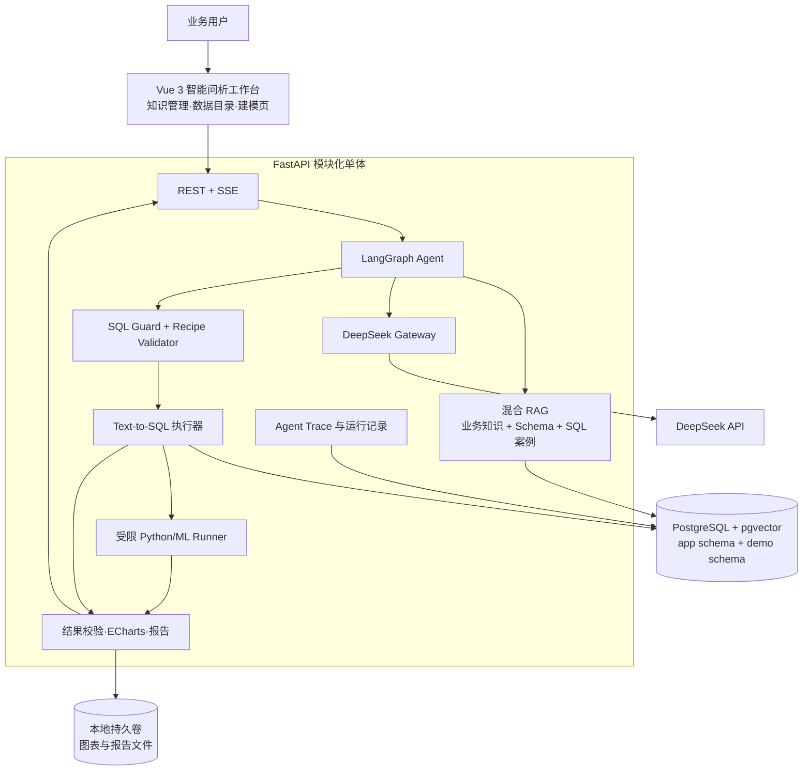
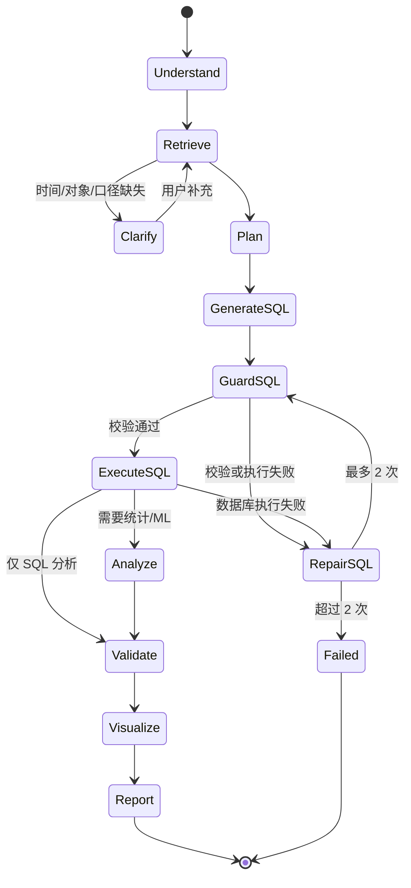

# A07《企业数据底座智能问析 Agent 系统》比赛版总体设计

| 项目 | 内容 |
|---|---|
| 文档定位 | 12 周可实现的竞赛版本设计，不含代码 |
| 赛题 | 2026“数字马力杯”第十三届浙江省大学生服务外包创新应用大赛 A07 |
| 命题单位 | 杭州自动化技术研究院 |
| 版本 | V2.0 比赛收敛版 |
| 编制日期 | 2026-08-23 |
| 设计目标 | 保留 DeepSeek + LangGraph + RAG + Text-to-SQL 技术主线，以三个制造场景形成稳定演示闭环 |

---

## 1. 收敛结论

### 1.1 一句话方案

建设一个面向制造业样例数据底座的智能问析 Agent：业务人员用自然语言提问，LangGraph 编排 DeepSeek 理解问题，RAG 检索业务指标与表字段，Text-to-SQL 生成并安全执行查询；必要时调用受限 Python/机器学习工具，最终输出可追溯的表格、图表和分析结论。

> 用户提问 → RAG 理解业务与数据 → Agent 制定分析计划 → Text-to-SQL/脚本执行 → 结果校验 → 图表与报告

### 1.2 从企业完整版收敛了什么

| 企业完整版 | 比赛版决策 | 原因 |
|---|---|---|
| Kubernetes、多副本、HA、灾备 | 删除；仅 Docker Compose 单机部署 | 不产生评分增益，12 周不可控 |
| 多租户、SSO、复杂 RBAC、行列级治理 | 删除；只保留管理员/分析用户两种简单角色 | 比赛使用单组织演示数据 |
| PostgreSQL/MySQL 多连接器、跨源分析 | 收敛为一个 PostgreSQL 演示数据源 | 保证 Text-to-SQL 的稳定性和可复现性 |
| FastAPI、Agent Worker、分析 Worker 多服务 | 合并为 FastAPI 模块化单体 + 受限子进程 Runner | 降低联调和部署成本 |
| Redis、Celery、MinIO | MVP 删除 | 小并发演示可由应用内任务状态和本地持久卷承担 |
| Prometheus/Grafana/Loki/OTel | 删除完整监控栈；保留结构化运行日志和 Agent Trace 页面 | 展示可观测过程，不建设运维平台 |
| 完整 MLOps | 删除模型注册、上线、漂移、自动重训；保留算法模板、训练、评估、推理和解释 | 直接满足赛题建模要求 |
| 四个制造主题 | 收敛为质量、设备、生产三个主题 | 与题目高频问题一致，演示叙事更集中 |
| 任意 Python 代码执行 | 收敛为 LLM 生成结构化 Recipe，由审核模板渲染可查看脚本并在独立进程执行 | 同时满足脚本生成/执行要求，避免自建代码沙箱 |

### 1.3 不可削减的技术核心

以下四项属于项目创新主线，进度紧张时也不得删除：

1. **DeepSeek 结构化推理**：完成意图识别、分析计划、SQL/脚本生成和结果解释。
2. **LangGraph 有界 Agent**：以状态机组织检索、规划、执行、校验、修复和报告，不做一次性聊天调用。
3. **业务知识 + 数据目录混合 RAG**：解决业务术语到表、字段、指标口径的映射，而非普通文档问答。
4. **有证据的 Text-to-SQL**：SQL 必须基于检索到的 schema 和指标定义生成、经过确定性校验、执行并返回证据链。

---

## 2. 赛题要求与比赛版实现映射

本设计以《赛题手册》A07 第 21—25 页为需求基线。

| 赛题要求/评分点 | 比赛版实现 | 演示证据 |
|---|---|---|
| 业务知识组织 | 三个主题下的业务对象、指标、规则、同义词 CRUD | 知识管理页、良率/停机/产量定义 |
| 数据资源理解 | 自动读取 PostgreSQL 表、字段、类型、说明、脱敏样例和关系 | 数据目录页、表关系图 |
| 自然语言分析 | 查询、排行、趋势、异常、简报五类意图 | 三个场景的自然语言问题 |
| SQL/脚本生成与执行 | DeepSeek 生成 SQL/结构化 Recipe；模板渲染可查看脚本并即席执行 | SQL/脚本抽屉、执行状态 |
| 建模能力 | 六类 scikit-learn 算法统一模板，提供训练、评估、简单推理和解释 | 建模页；主演示 Isolation Forest、线性回归 |
| Agent 闭环 | RAG、规划、工具调用、结果校验、最多两次 SQL 修复、报告 | Agent 步骤时间线 |
| 展示效果 | 数据表、ECharts、关键发现、简要报告 | 问析工作台 |
| 工程可用性 | Compose 一键启动、只读账号、超时限行、错误提示、离线演示预案 | 现场连续演示与测试报告 |
| 应用价值 | 质量、设备、生产三个制造场景 | 8 分钟完整演示主线 |

---

## 3. MVP 功能边界

### 3.1 MVP 必须完成（P0）

#### A. 数据与知识底座

- 一个 PostgreSQL 演示数据源：9 张主演示表 + 1 张仅用于未知 schema 验收的留出表；
- 自动读取表、字段、字段类型、注释、主外键和最多 3 个脱敏样例值；
- 质量、设备、生产三个分析主题；
- 业务对象、业务指标、业务规则和同义词的基础增删改查；
- 表关系图只展示真实主外键和人工确认关系，不实现通用知识图谱平台。

#### B. 智能问析

- 单轮提问 + 必要的一轮澄清；
- 识别指标、维度、筛选条件、时间范围和分析类型；
- 展示 Agent 当前步骤、检索证据、分析计划、SQL/脚本、执行结果；
- 支持查询、分组统计、排行、趋势、异常和简要报告；
- 结果支持表格、折线图、柱状图、Pareto 图、散点图和异常点图；
- 最终结论引用本次 SQL/脚本结果，不允许无数据依据的原因推断。

#### C. Text-to-SQL 与安全执行

- DeepSeek 基于 RAG 上下文生成 PostgreSQL `SELECT/CTE`；
- SQLGlot 完成语法树解析、表字段白名单、多语句和 DDL/DML 拦截；
- 数据库使用专用只读账号；
- 默认 `LIMIT 1000`、30 秒超时，禁止笛卡尔积和无条件大表扫描；
- SQL 执行失败允许 Agent 携带错误摘要修复，最多 2 次；
- 用户可查看最终 SQL、所用表字段、执行耗时和结果行数。

#### D. 脚本与建模

- LLM 只生成通过 JSON Schema 校验的结构化分析 Recipe，不直接产生可执行任意源码；
- 系统把 Recipe 填入人工审核过的 scikit-learn 模板，渲染出可查看、可复现的 Python 脚本；
- 模板脚本在独立子进程中运行，仅能读取本次 SQL 结果文件，限制为白名单包、固定输出目录和 60 秒时长；
- 算法模板覆盖线性回归、逻辑回归、决策树、随机森林、KMeans、Isolation Forest；
- 所有算法共用数据选择、特征选择、训练/验证、指标展示和简单推理流程；
- 不允许用户上传或执行任意 Python 文件。

#### E. 交付与可用性

- Docker Compose 一键启动；
- 管理员、分析用户两种简单角色；
- DeepSeek API 异常、SQL 失败、空结果、超时均有明确提示；
- 三个核心场景在固定演示数据上连续运行三次成功；
- 具备产品手册、业务知识说明、数据资源说明、过程分工文档和演示视频。

### 3.2 有余力再做（P1）

- 多轮追问继承上一次筛选条件；
- 问题收藏与重新运行；
- 报告导出为 Markdown/PDF；
- 轻量 reranker；
- 指标或字段纠错反馈；
- 决策树/随机森林特征重要性和简单规则解释；
- 现场问答的备用模型适配器。

### 3.3 明确不做（Out of Scope）

- Kubernetes、微服务治理、服务网格、高可用与灾备；
- 多租户、复杂组织权限、SSO、行级策略中心；
- MySQL/Oracle/Excel 等多源接入和跨源联邦查询；
- 企业数据实时同步、CDC、血缘分析和主数据治理；
- 模型注册、在线部署、漂移监控、自动重训和特征平台；
- 通用 BI 拖拽、自定义大屏、定时报表和移动端；
- 基础模型训练、微调和私有化推理集群；
- 无限制的自主 Agent、任意网络工具和任意代码执行。

### 3.4 MVP 页面范围

| 页面 | 核心能力 | 是否 P0 |
|---|---|---:|
| 智能问析工作台 | 提问、步骤时间线、SQL/脚本、表格、图表、结论 | 是 |
| 数据资源目录 | 表、字段、类型、注释、样例、关系图 | 是 |
| 业务知识管理 | 主题、对象、指标、规则、同义词维护 | 是 |
| 轻量建模页 | 六类算法统一入口、训练、评估、推理、解释 | 是 |
| 运行记录 | 查看历史问析、失败原因和耗时 | 是，简版 |
| 系统配置 | 模型连通状态、V4 Pro/Flash 选择；API Key 与模型仅由前端页面提交到后端进程内存 | 是，简版 |
| 评测看板 | 金标问题批量回归与统计 | P1，可先用脚本生成报告 |

---

## 4. 三个制造业场景

### 4.1 质量分析

**用户角色**：质量主管。

**核心问题**：

- “分析本月各工序良率，并找出下降最明显的工序。”
- “找出最近一个月不良数量最高的产品和主要缺陷类型。”
- “生成一份本周质量分析简报。”

**数据**：质量检验、缺陷记录、产品、工序、生产批次。

**指标**：检验数量、合格数量、不良数量、良率、不良率、缺陷占比。

**技术链**：RAG 命中“良率”口径和质量表 → Text-to-SQL 分组统计 → Pareto/趋势图 → DeepSeek 基于结果生成简报。

**价值展示**：业务人员无需知道表名、字段或 SQL，即可获得统一口径的质量结果。

### 4.2 设备异常

**用户角色**：设备工程师。

**核心问题**：

- “识别最近 30 天停机行为异常的设备，并说明异常依据。”
- “统计停机时长最高的设备及主要停机原因。”

**数据**：设备主数据、停机记录、报警记录。

**特征**：停机总时长、停机次数、平均停机时长、报警次数、夜间停机比例。

**技术链**：Text-to-SQL 聚合设备特征 → Agent 选择 Isolation Forest → 生成 Recipe 并渲染/执行审核脚本 → 输出异常分数、异常点图和特征偏离说明。

**价值展示**：系统不只“查数”，还能自动完成特征构建、模型选择和异常解释。

### 4.3 生产趋势

**用户角色**：生产经理。

**核心问题**：

- “统计每条产线最近 7 天产量趋势，找出下降最明显的产线。”
- “分析本月计划达成率，并比较各产线表现。”

**数据**：生产工单、工序产量、产线、日期。

**指标**：实际产量、计划产量、计划达成率、日产量变化率、趋势斜率。

**技术链**：RAG 命中产量和计划达成率口径 → Text-to-SQL 按产线/日期聚合 → 线性回归计算趋势斜率 → 折线图和排名 → 生成生产趋势摘要。

**价值展示**：用统一问析链同时展示 SQL 统计与轻量建模能力。

### 4.4 演示数据最小集合

建议准备 9 张主演示业务表，保持关系真实、数据可解释；另准备 1 张不进入验证案例库的留出表，仅用于未知 schema 验收：

| 类型 | 表 |
|---|---|
| 维表 | `dim_product`、`dim_process`、`dim_line`、`dim_equipment` |
| 生产 | `fact_work_order`、`fact_process_output` |
| 质量 | `fact_quality_inspection`、`fact_quality_defect` |
| 设备 | `fact_equipment_event` |

留出表可采用 `fact_shift_summary`，只提供字段注释和主外键，不预置问题—SQL 案例；系统刷新元数据和向量索引后，应能定位其日期、班次、产线和产量字段。

数据规模控制在 10 万—50 万行，覆盖最近 90 天；人工植入 5—8 个可解释异常、2 条明显下降趋势和稳定的缺陷 Pareto 分布。保留少量缺失值、重复记录和同义词，证明系统具备真实数据意识，但不让脏数据破坏主演示。

所有相对时间均以 `demo_dataset.max_business_date` 为基准，而不是运行当天。界面必须把“本月”“最近 30 天”“最近 7 天”解析后的实际起止日期展示给用户，避免静态比赛数据随日期变化而返回空结果。

### 4.5 事实粒度与 Join 规则

| 表 | 主键 | 一行代表什么 | 业务时间 | 允许的主要关联 |
|---|---|---|---|---|
| `dim_product` | `product_id` | 一个产品 | — | 被工单、检验引用 |
| `dim_process` | `process_id` | 一个工序 | — | 被产量、检验引用 |
| `dim_line` | `line_id` | 一条产线 | — | 被工单、产量、设备引用 |
| `dim_equipment` | `equipment_id` | 一台设备 | — | `line_id` → 产线；被事件引用 |
| `fact_work_order` | `work_order_id` | 一个生产工单 | `plan_date` | 产品、产线；只提供计划数量 |
| `fact_process_output` | `output_id` | 某工单在某工序某日产出汇总；含 `is_final_process` | `output_date` | 工单、工序、产线 |
| `fact_quality_inspection` | `inspection_id` | 一次产品/工序检验 | `inspection_time` | 工单、产品、工序 |
| `fact_quality_defect` | `defect_record_id` | 一次检验中的一种缺陷汇总 | 沿用检验时间 | `inspection_id` → 检验 |
| `fact_equipment_event` | `event_id` | 一次停机或报警事件 | `start_time/end_time` | `equipment_id` → 设备 |

确定性规则：

1. 良率只从检验事实表的 `qualified_qty / inspected_qty` 计算；
2. 缺陷 Pareto 先按 `inspection_id + defect_type` 聚合，再与检验范围关联；禁止把检验表直接连接缺陷明细后计算良率，避免一对多放大；
3. “产量”和计划达成率中的实际产量只统计 `is_final_process = true` 的末工序完工数量，禁止把多个工序产量相加；工序级趋势另按指定工序单独计算；
4. 计划达成率先把工单计划量按产线/日期聚合，再与同粒度末工序完工数量关联；`fact_process_output.line_id` 必须与所属工单产线一致；
5. 设备事件按设备/业务日先计算时长和次数，再送入异常模型；
6. RAG 只提供人工确认过的关系和基数，Text-to-SQL 不得猜测连接键。

---

## 5. 比赛版技术架构

### 5.1 总体架构



### 5.2 部署形态

比赛现场只运行三个容器：

1. `web`：Vue 3 构建产物 + Nginx；
2. `app`：FastAPI、LangGraph、RAG、SQL 工具、受限 Python Runner；
3. `postgres`：平台表、演示业务表和 pgvector。

DeepSeek 使用远程 API。Compose 配置演示数据初始化和健康检查；不引入 Kubernetes、Redis、Celery、MinIO 和完整监控栈。Agent 运行状态写入 PostgreSQL，前端通过 SSE 获取步骤事件。

### 5.3 核心技术选型

| 层次 | 比赛版选型 | 取舍 |
|---|---|---|
| 前端 | Vue 3 + TypeScript + Vite + Element Plus | 企业后台开发快，组件成熟 |
| 图表 | Apache ECharts | 覆盖趋势、Pareto、散点、异常点 |
| 后端 | Python 3.12 + FastAPI + Pydantic | 与 LLM、SQL、ML 同一语言栈 |
| Agent | LangGraph | 显式状态、条件路由、修复次数和 Trace |
| 大模型 | DeepSeek API，经轻量 Gateway 调用 | 模型 ID 配置化，启动时冒烟测试 |
| 数据库 | PostgreSQL 16 + pgvector | 同时保存业务数据、元数据、知识和向量 |
| Embedding | 中文轻量 Embedding 模型，启动前离线建索引 | 避免现场依赖 GPU；具体模型按设备实测 |
| SQL | SQLAlchemy + SQLGlot + 只读账号 | 执行与 AST 安全校验 |
| 分析/ML | Pandas + SciPy + scikit-learn | 覆盖赛题指定统计与建模任务 |
| 测试 | Pytest + Vitest + Playwright | 覆盖 Agent、SQL、接口和主演示 |
| 部署 | Docker Compose | 一条命令启动、便于评委复现 |

### 5.4 简化数据设计

同一 PostgreSQL 实例分两个 schema，并使用两个数据库身份：

- `demo`：9 张主演示表 + 1 张验收留出表，由 `demo_reader` 只读账号访问；
- `app`：系统配置、知识、元数据、对话和运行记录，由 `app_writer` 读写账号访问。

`app` 只保留 MVP 必需表：

| 领域 | 表 |
|---|---|
| 数据目录 | `catalog_table`、`catalog_column`、`catalog_relation` |
| 业务知识 | `business_topic`、`business_object`、`metric`、`business_rule`、`synonym` |
| RAG | `knowledge_chunk`（含 embedding、source_type、source_id） |
| 问析 | `conversation`、`message`、`analysis_run`、`run_step` |
| 结果 | `sql_artifact`、`code_artifact`、`result_snapshot`、`chart_spec` |
| 建模 | `model_run`（算法、特征、参数、指标、结果摘要） |
| 配置 | `app_config`（包括 `dataset_max_business_date`、模型 ID，不保存 API Key） |

不设计租户表、复杂权限表、策略中心、对象存储元数据、模型版本库和运维审计库。

---

## 6. Agent、RAG 与 Text-to-SQL 设计

### 6.1 LangGraph 主流程



Agent 采用一个共享 `AnalysisState`，包含问题、意图、指标/维度/时间、RAG 证据、分析计划、SQL、结果、脚本、图表和错误。最大 SQL 修复 2 次、最大澄清 1 次、最大工具步骤 10 个；超过限制直接返回可理解的失败说明。

### 6.2 DeepSeek 的明确职责

DeepSeek 只承担四类高价值任务：

1. 将自然语言解析为结构化意图；
2. 基于 RAG 证据生成 `AnalysisPlan`；
3. 生成 PostgreSQL SQL 或结构化分析 Recipe；
4. 基于真实执行结果生成结论和简报。

DeepSeek 不直接持有数据库连接、不决定安全放行、不虚构指标定义。所有结构化输出经 Pydantic/JSON Schema 校验；Python 代码由审核模板根据 Recipe 确定性渲染。模型 ID、思考模式和超时配置化；比赛前以项目 API Key 验证 JSON 输出、工具调用和流式响应。

### 6.3 比赛版 RAG

RAG 只索引三类高价值内容：

- **业务知识**：三个主题下的对象、指标、规则、同义词；
- **数据目录**：表、字段、说明、脱敏样例、真实关系；
- **验证案例**：每个场景 5—10 条人工确认的问题—SQL 案例。

在线检索流程：

1. 指标名、字段名、同义词精确匹配；
2. `pg_trgm` 模糊检索与 pgvector 语义检索并行；
3. 沿真实表关系扩展一跳；
4. 规则融合并取 Top 8—12 条证据；
5. 生成包含指标公式、候选表字段、Join 路径和来源的 `EvidenceBundle`。

MVP 不建设独立 OpenSearch、知识图谱数据库、蓝绿向量索引和复杂知识发布流程。知识修改后对相关 chunk 重新生成 embedding 即可。验证案例与 30 个金标问题严格隔离；另准备一张不进入 SQL 案例库的留出表，在数据目录刷新后测试未知 schema 检索，防止把记忆固定 SQL 误当成泛化能力。

### 6.4 Text-to-SQL 可靠性设计

Text-to-SQL 不把整个数据库 schema 一次性塞给模型，而是只传递 RAG 命中的候选表、字段、指标和关系。执行链为：

```text
自然语言 → EvidenceBundle → AnalysisPlan → SQL Candidate
→ SQLGlot AST 校验 → EXPLAIN/限行 → 只读执行
→ 结果形状校验 → 必要时有限修复 → 图表和结论
```

主要防错规则：

- SQL 仅允许单条 `SELECT`/CTE；
- 引用表字段必须存在于候选 schema；
- Join 必须使用目录中已登记关系；
- 良率等比率先聚合分子/分母再相除；
- 时间范围统一使用演示库中的业务日期和 Asia/Shanghai 时区；
- 空结果先检查时间和筛选条件，不由模型编造答案；
- 最终回答显示“使用指标、使用表、SQL、数据范围、结果行数”。

### 6.5 六类算法的轻量实现

| 算法 | 比赛版实现 | 主要场景 |
|---|---|---|
| 线性回归 | 趋势模式输出斜率；建模验收模式提供训练/验证、MAE/R²和系数解释 | 生产趋势 |
| 逻辑回归 | 分层切分、准确率/F1/AUC、系数解释 | 质量分类能力验证 |
| 决策树 | 深度限制、准确率/F1、规则/特征重要性 | 质量分类能力验证 |
| 随机森林 | 树数与深度白名单、准确率/F1、特征重要性 | 质量分类能力验证 |
| KMeans | 标准化、轮廓系数、簇画像 | 设备运行模式能力验证 |
| Isolation Forest | 异常比例白名单、异常分数、特征对比 | 设备异常主演示 |

这是“统一模板引擎”，不是 MLOps：模型只服务本次分析运行，保存参数、指标和结果摘要，不发布在线模型、不自动重训。

线性回归区分两种模式：主演示的“趋势计算模式”只对 7 天序列拟合斜率，用于描述方向，不展示训练/验证指标、不声称预测能力；独立“建模验收模式”使用更长时间样本，才展示训练/验证、MAE 和 R²。

---

## 7. 12 周开发路线

### 7.1 周计划与退出条件

| 周次 | 目标 | 关键任务 | 周末必须达到的结果 |
|---|---|---|---|
| 第 1 周 | 锁定范围与数据 | 赛题矩阵、三场景故事、9 表粒度/Join、指标口径、30 个金标问题 | 数据字典和演示脚本定稿，不再增加场景 |
| 第 2 周 | 工程骨架 | Vue/FastAPI/PostgreSQL/Compose、元数据最小读取、DeepSeek 冒烟 | 三容器可启动，前后端、数据库和模型连通 |
| 第 3 周 | 最薄端到端闭环 | 用一个质量问题打通最小 LangGraph、精确 schema 检索、SQL 生成/校验/执行、柱状图和结论 | 首条“提问→检索→SQL→图表→结论”可运行，不追求高精度 |
| 第 4 周 | 数据目录、知识与混合 RAG | 元数据/样例/关系、知识 CRUD、Embedding、精确/模糊/向量融合 | 可展示未知表资源；相关表字段 Recall@8 ≥ 85% |
| 第 5 周 | Agent 完整化 | 结构化计划、澄清、条件路由、步骤 Trace、证据包和结论约束 | 完整展示“理解—检索—规划—执行—校验” |
| 第 6 周 | Text-to-SQL 加固 | SQLGlot、Join/指标粒度规则、只读执行、超时限行、两次修复 | 15 个基础问题端到端正确率 ≥ 80% |
| 第 7 周 | 质量场景 | 良率、不良率、缺陷 Pareto、环比和质量简报 | 质量场景连续运行三次成功 |
| 第 8 周 | Recipe 模板与设备异常 | 模板渲染 Runner、特征 SQL、Isolation Forest、特征偏离说明 | 设备场景连续运行三次成功 |
| 第 9 周 | 生产趋势 | 趋势 SQL、计划达成率、线性回归斜率和图表 | 三个场景均形成稳定闭环 |
| 第 10 周 | 六算法能力补齐 | 其余四类算法模板、统一训练/评估/推理界面、留出 schema 测试 | 六类算法均有验收用例，未知表测试通过 |
| 第 11 周 | 稳定性与评测 | 30 个金标问题、12 个异常/攻击问题、错误降级、UI 收口 | 无 P0 阻断缺陷；固定问题集达标 |
| 第 12 周 | 交付与彩排 | PPT、详细方案、视频、手册、知识/数据说明、过程文档、答辩彩排 | 材料齐全；8 分钟流程连续演示三次 |

### 7.2 关键里程碑

- **M0，第 3 周：最薄闭环可运行**——尽早暴露 DeepSeek、Agent、SQL 和前端集成风险；
- **M1，第 4 周：能理解数据**——业务知识、数据目录和 RAG 可用；
- **M2，第 7 周：质量主线完整**——自然语言到 SQL、执行、图表、结论闭环稳定；
- **M3，第 10 周：三个场景完整**——质量、设备、生产均可演示，六类算法有验证；
- **M4，第 12 周：可交付**——系统稳定、材料完整、演示可复现。

### 7.3 团队分工建议

| 角色 | 主要责任 |
|---|---|
| Agent/后端 | DeepSeek Gateway、LangGraph、Text-to-SQL、SQL Guard |
| 数据/算法 | 演示数据、指标口径、RAG、Python Runner、六类算法、金标答案 |
| 前端 | 问析工作台、Trace、数据目录、知识管理、图表、建模页 |
| 产品/测试/交付 | 场景故事、测试、文档、PPT、视频、答辩；同时承担集成协调 |

3 人团队可由 Agent/后端负责人兼任架构与集成，并同时承担 RAG；六算法严格复用一个页面和六套模板，关系图使用现成组件，角色权限/运行记录/系统配置只做最低可演示版本。产品文档、测试证据和过程记录每周同步产出，不能留到第 12 周集中补齐。

### 7.4 进度失控时的裁剪顺序

不得裁剪：三场景主问题、RAG、LangGraph 步骤、Text-to-SQL、安全校验、SQL/脚本可查看、结果图表和结论。

按以下顺序裁剪：

1. PDF 导出、收藏、分享和多轮上下文；
2. 独立评测看板，改为命令行生成测试报告；
3. 复杂关系图动画和 UI 装饰；
4. 四个非主演示算法的高级解释，仅保留训练/评估/推理；
5. 备用模型和额外图表类型。

第 11 周起禁止新增功能，只修复、测试、准备材料和优化演示。

---

## 8. 比赛演示流程

### 8.1 8 分钟现场主线

| 时间 | 演示内容 | 要证明的评分点 |
|---:|---|---|
| 0:00—0:30 | 说明痛点与产品一句话定位 | 应用价值、项目目标 |
| 0:30—1:15 | 数据目录 + 知识管理：表字段/样例/关系、良率/停机/产量口径 | 数据资源理解、业务知识组织 |
| 1:15—3:25 | **完整实时展开质量场景**：RAG、计划、SQL、图表、简报 | Text-to-SQL、Agent 闭环、展示效果 |
| 3:25—5:35 | **完整实时展开设备场景**：特征 SQL、Recipe/脚本、Isolation Forest、偏离解释 | 脚本执行、建模、异常分析 |
| 5:35—6:35 | **快速展示生产场景**：一键运行预验证问题，折叠中间步骤，只展开趋势斜率与关键 Trace | 生产应用、线性回归 |
| 6:35—7:25 | 回到一次完整 Agent Trace，强调证据、SQL/脚本、安全校验和真实日期范围 | 过程可见、可信性 |
| 7:25—8:00 | 展示固定评测摘要并总结核心创新 | 工程可用性、项目价值 |

危险 SQL 拦截、空结果处理、六算法能力页和留出 schema 测试放在答辩备份页，只有评委追问或主流程提前结束时展示，不与主线争抢时间。

### 8.2 三个主问题的演示脚本

#### 演示一：质量分析

输入：

> 分析本月各工序良率，找出较上月下降最明显的工序，并给出主要缺陷类型。

界面依次展示：

1. RAG 命中“工序良率”公式、质量表、工序表和缺陷表；
2. Agent 计划：本月/上月聚合 → 计算良率 → 排序 → 缺陷 Pareto；
3. 生成并通过校验的 SQL；
4. 良率对比柱状图、趋势图、缺陷 Pareto；
5. 基于结果的三条发现和数据限制；
6. 一键形成“本月质量分析简报”。

#### 演示二：设备异常

输入：

> 识别最近 30 天停机行为异常的设备，并说明为什么异常。

界面依次展示：

1. Agent 判断这是“SQL 特征构建 + 异常检测”复合任务；
2. SQL 聚合停机时长、次数、平均时长、报警次数等特征；
3. 展示由结构化 Recipe 渲染的审核 Python 脚本，调用 Isolation Forest；
4. 展示异常分数排名和二维异常点图；
5. 说明某设备因“停机时长和夜间停机比例显著偏高”被标记，而非虚构故障原因。

#### 演示三：生产趋势

输入：

> 统计每条产线最近 7 天的产量趋势，找出下降最明显的产线，并比较计划达成率。

界面依次展示：

1. RAG 命中产量和计划达成率口径；
2. SQL 按日期、产线聚合实际产量和计划产量；
3. 线性回归仅用于计算各产线趋势斜率，不包装为可靠预测模型；
4. 折线图、达成率柱状图和下降排名；
5. 输出“数据事实—趋势判断—建议关注”的分层结论。

### 8.3 演示可靠性预案

- 比赛前固定模型 ID、提示词版本、演示数据版本和系统镜像；
- 每个主问题准备“一键填入”，避免现场输入错误；质量与设备完整实时展开，生产场景使用预验证问题的快速模式；
- 演示数据预热，RAG 索引提前构建；
- DeepSeek 调用设 30 秒超时、最多 1 次重试；正式排时以彩排实测 P95 为准，主流程不按超时最坏值强行塞满；
- 保留最近一次成功运行结果，只在 API 故障时明确切换为“历史运行回放”，不得伪装为实时结果；
- 现场准备录屏作为最终兜底，但系统实时主流程必须在赛前连续通过三次；
- 所有主问题准备空结果、模型超时和 SQL 修复的可解释降级提示。

### 8.4 评委追问时的核心回答

**为什么不是普通聊天机器人？**

因为系统通过 LangGraph 调用 RAG、SQL、Python/ML 和结果校验工具，答案来自真实执行结果，并可查看完整证据链。

**RAG 的价值是什么？**

RAG 解决“业务良率”到“指标公式、表字段和 Join 关系”的映射，降低 Text-to-SQL 在未知表上的幻觉。

**大模型是否直接操作数据库？**

不会。DeepSeek 只生成结构化计划和候选 SQL，确定性 SQL Guard 通过后才使用只读账号执行。

**为什么只做三个场景？**

三个场景分别覆盖指标/报告、异常检测、趋势/回归，已经完整体现赛题要求的业务理解、SQL、脚本、建模、可视化和 Agent 闭环；集中建设比铺设低质量功能更有说服力。

---

## 9. 验收标准

| 类别 | 固定测试集目标 |
|---|---:|
| RAG 相关表/字段 Recall@8 | ≥ 90% |
| 30 个金标问题端到端完成率 | ≥ 85% |
| 关键指标数值正确率 | ≥ 95% |
| 生成 SQL 语法有效率 | ≥ 95% |
| 危险 SQL 测试集拦截率 | 100% |
| 三个主演示连续成功率 | 规定环境下连续三次 100% |
| 成功回答展示 SQL/结果/证据链 | 100% |
| 简单问析目标耗时 | ≤ 15 秒 |
| 含建模问析目标耗时 | ≤ 60 秒 |

测试集构成：每个场景 10 个金标问题，另设 12 个歧义、空结果、越权、DDL/DML、提示词注入和错误字段问题。金标问题与 RAG 中的验证案例按问题模板和 SQL 结构去重，禁止数据泄漏；另使用一张留出表验证元数据刷新后的未知 schema 理解。分别统计 RAG 命中、SQL 可执行、业务语义正确、数值正确和结论有据，不能用“SQL 能运行”替代“分析正确”。

技术答辩提供一组小型消融对照：相同问题分别使用“仅完整 schema 提示”和“混合 RAG EvidenceBundle”，比较候选表字段召回、SQL 语义正确率和输入 Token，证明 RAG 对 Text-to-SQL 的实际增益，而不是只展示架构名词。

---

## 10. 最终项目定义

比赛版不是企业数据平台的缩小复制品，而是一个技术闭环完整、范围明确、现场可运行的制造业智能问析原型：

- 用 DeepSeek 理解、规划、生成和解释；
- 用 LangGraph 形成可见、可控、可修复的 Agent 流程；
- 用业务知识和数据目录 RAG 理解未知表资源；
- 用安全 Text-to-SQL 查询真实数据；
- 用受限 Python/ML 完成设备异常和生产趋势分析；
- 用三个高质量制造场景完整覆盖赛题评分点。

项目的核心表达应始终保持一致：

> 我们不是把数据库接到聊天框，而是让 Agent 先理解企业语义，再以受控工具完成可验证的数据分析。
