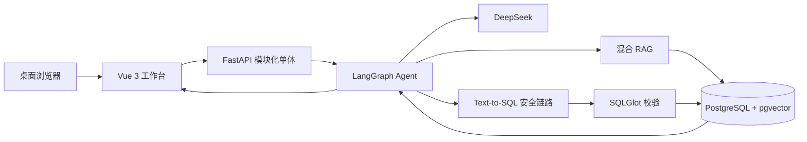

# A07 企业数据底座智能问析 Agent

面向浙江省大学生服务外包创新应用大赛 A07 赛题的制造业数据智能问析系统。项目以 **DeepSeek + LangGraph + RAG + Text-to-SQL** 为核心技术链路，让业务人员使用自然语言完成质量分析、设备异常诊断和生产趋势分析，并保留证据、SQL、数据结果与 Agent 轨迹供复核。

当前版本：`0.9.0`，比赛功能收口版。系统只面向电脑网页端，统一推荐使用 `1440 × 900` 分辨率演示与验收。

## 项目定位

传统企业数据平台需要使用者理解表结构、指标口径和 SQL。本系统在制造业演示数据底座上增加业务知识检索、Agent 编排和受控 SQL 执行能力，将一次问析组织为可追踪的工作流：

1. 先检查制造场景、指标、时间范围、分析维度和目标是否完整；信息不足时进入歧义澄清，不调用模型、不生成 SQL；
2. 从指标口径、业务规则、Schema、外键关系和验证案例中检索证据；
3. 由 DeepSeek 生成 Text-to-SQL；
4. 使用 SQLGlot 校验单条只读 SQL、表白名单、时间范围和返回行数；
5. 在 PostgreSQL 只读事务中执行，失败时最多进行两轮 SQL 修复；
6. 返回结论、结果表、可读图表、引用证据、SQL 和完整 Agent 节点轨迹；
7. 支持将查询结果导出为 UTF-8 CSV，将带坐标轴、单位和标题的图表导出为 PNG。
8. 支持基于上一轮结论继续追问、主动取消长任务并按原参数重试。

系统强调“有依据地分析”，而不是只展示一段大模型回答。

## 核心能力

| 能力域 | 已实现功能 |
| --- | --- |
| 企业数据目录 | 自动扫描 PostgreSQL 表、字段、类型、注释、样例与真实外键关系 |
| 受控数据导入 | 质量检验、设备事件、生产完工三类固定 CSV 模板，整批校验与原子写入 |
| 业务知识中心 | 维护主题、业务对象、指标口径、强规则、同义词和验证案例 |
| 混合 RAG | 精确匹配、`pg_trgm` 模糊匹配、`pgvector` 语义检索与 RRF 融合 |
| 通用智能问析 | LangGraph 十节点能力图（上下文与 SQL 修复按需执行）、多轮追问、歧义澄清、DeepSeek Text-to-SQL、结果解释 |
| 质量分析 | 工序良率、缺陷 Pareto、30 天趋势、月度环比和管理层质量简报 |
| 设备异常 | Isolation Forest 异常检测、设备排名、特征偏离和事件原因核查线索 |
| 生产趋势 | 完工量、计划达成率、产线排名与最近七日线性趋势斜率 |
| 算法验收 | Linear/Logistic Regression、Decision Tree、Random Forest、KMeans、Isolation Forest 六套可复现 Recipe |
| 审核与解释 | EvidenceBundle、SQL Artifact、结果快照、图表坐标轴、节点耗时和运行记录 |
| 问析质量评测 | 6 项质量门禁、16 个固定 RAG 案例、最近 50 次真实运行、歧义澄清漏斗 |
| 结果导出 | 查询明细 UTF-8 CSV、当前分析图表 PNG；导出内容附带可读字段名、轴标题与单位 |
| 模型配置 | 前端填写并验证 DeepSeek API Key，可选择 `deepseek-v4-pro` 或 `deepseek-v4-flash` |

## 技术架构



主要技术选型：

- 前端：Vue 3、TypeScript、Vite；
- 后端：Python 3.12、FastAPI、Pydantic、SQLAlchemy、psycopg；
- Agent：LangGraph、OpenAI 兼容 SDK、DeepSeek；
- RAG：FastEmbed `BAAI/bge-small-zh-v1.5`、pgvector、pg_trgm、RRF；
- SQL 安全：SQLGlot、只读事务、5 秒超时、最多 100 行结果；
- 数据算法：scikit-learn；
- 部署：Docker Compose，或本地源码运行。

## 三个业务场景

### 质量分析

支持良率、缺陷数量、工序/产线排名、缺陷 Pareto、日趋势与月度环比。质量专项 Agent 会并行组织多组证据和只读 SQL，最终生成可复核的管理层简报。

### 设备异常

使用固定训练窗口和随机种子的 Isolation Forest 对设备日粒度特征进行评分。结果给出异常设备、报警与停机特征偏离、异常日期和事件核查线索；算法只负责识别异常，不把相关性包装为根因。

### 生产趋势

汇总末工序完工量、计划达成率、29 日走势和产线排名，并用最近七个业务日的线性斜率描述短期方向。该结果是趋势计算，不是未来产量预测。

## 数据说明

当前比赛版本使用系统内置的可解释制造业模拟数据，而不是连接真实企业生产库：

- `demo` Schema：9 张主演示表和 1 张未知 Schema 留出表；
- `app` Schema：知识、目录、Agent 运行、SQL Artifact 和算法 Recipe；
- 数据规模约 11.8 万行；
- 固定业务日期为 `2025-12-29`，保证每次演示结果可复现；
- 后端启动时自动执行未应用的 SQL 迁移、刷新元数据目录并补齐 RAG 索引。
- 可从“数据目录”按三种固定 CSV 模板追加比赛日期范围内的演示业务数据；不允许任意表和任意字段写入。

接入真实企业数据时，应替换数据源和业务知识，不需要重写 Agent 主流程。

## 目录结构

```text
A07 Agent/
├─ apps/web/                  # Vue 3 桌面工作台与 Nginx 配置
├─ services/app/              # FastAPI、Agent、RAG、算法和数据库迁移
│  ├─ app/agent/              # 通用及三个专项 LangGraph
│  ├─ app/rag/                # 索引构建与混合检索
│  ├─ app/integrations/       # DeepSeek 适配器
│  └─ migrations/             # 业务数据和各阶段增量迁移
├─ infra/postgres/init/       # PostgreSQL 首次初始化
├─ scripts/local/             # 本地安装、启停与验收脚本
├─ scripts/test-stage*.ps1    # Docker 阶段验收脚本
├─ tests/e2e/                 # 桌面端 Playwright 测试
├─ docs/engineering/          # 工程计划与阶段测试报告
└─ compose.yml                # Docker Compose 编排
```

## 方式一：Docker Compose 启动

适合快速演示和统一环境，需要 Docker Desktop。

```powershell
Copy-Item .env.example .env
docker compose up --build -d
docker compose ps
```

打开 <http://localhost:8080>。后端健康检查为 <http://localhost:8000/api/health>，API 文档为 <http://localhost:8000/docs>。

停止服务：

```powershell
docker compose down
```

不要执行 `docker compose down -v`，除非确认要清空本地数据库卷。

## 方式二：Windows 本地部署

本地模式直接运行 Python 后端和构建后的 Vue 前端，不依赖应用容器。完整本地部署还需要：

- Python 3.12；
- Node.js 22 LTS；
- PostgreSQL 16；
- PostgreSQL 已安装 pgvector 扩展，且 `psql` 已加入 `PATH`。

Docker 模式和本地模式都使用 8000、8080 端口，切换前请先停止另一种模式。

### 1. 初始化本机数据库

确保 PostgreSQL 服务已启动，然后在项目根目录执行：

```powershell
powershell -ExecutionPolicy Bypass -File .\scripts\local\init-database.ps1
```

脚本会创建本地开发数据库 `a07_agent`、账号 `a07_app`，并启用 `vector` 和 `pg_trgm`。默认口令仅供个人电脑比赛环境使用，不应复用于公网或生产环境。

如 PostgreSQL 不在默认地址，可指定参数：

```powershell
.\scripts\local\init-database.ps1 -DatabaseHost 127.0.0.1 -Port 5432 -AdminUser postgres
```

### 2. 安装依赖

```powershell
powershell -ExecutionPolicy Bypass -File .\scripts\local\setup.ps1
```

脚本会创建根目录 `.venv`、安装 Python/Node 依赖、构建前端、生成 `services/app/.env`，并下载本地中文向量模型。首次执行需要联网且耗时较长。

### 3. 启动系统

```powershell
powershell -ExecutionPolicy Bypass -File .\scripts\local\start.ps1
```

启动后访问 <http://127.0.0.1:8080>。运行日志位于 `.local-runtime/`。

基础验收：

```powershell
powershell -ExecutionPolicy Bypass -File .\scripts\local\verify.ps1
```

停止系统：

```powershell
powershell -ExecutionPolicy Bypass -File .\scripts\local\stop.ps1
```

### 可选：应用本地运行，仅数据库使用 Docker

Windows 本机暂未安装 pgvector 时，可以只启动数据库容器：

```powershell
docker compose down
docker compose up -d postgres
```

执行本地 `setup.ps1` 后，将 `services/app/.env` 中数据库端口从 `5432` 改为 Docker 映射端口 `55432`，再运行 `start.ps1`。此方式仍然不启动 `app` 和 `web` 容器。

## macOS / Linux 手动本地运行

数据库初始化脚本为标准 `psql` 脚本，可按顺序执行：

```bash
psql -U postgres -d postgres -f scripts/local/001-create-database.sql
psql -U postgres -d a07_agent -f infra/postgres/init/001-bootstrap.sql
psql -U postgres -d a07_agent -f scripts/local/002-local-ownership.sql
```

安装并启动后端：

```bash
python3.12 -m venv .venv
. .venv/bin/activate
pip install -r services/app/requirements.txt
python -c "from fastembed import TextEmbedding; TextEmbedding(model_name='BAAI/bge-small-zh-v1.5', cache_dir='services/app/.cache/fastembed')"
cp services/app/.env.example services/app/.env
cd services/app
../../.venv/bin/python -m uvicorn app.main:app --host 127.0.0.1 --port 8000
```

另开终端启动前端：

```bash
cd apps/web
npm ci
npm run start:local
```

## DeepSeek 配置

DeepSeek API Key 只允许在前端运行时配置：

1. 打开工作台；
2. 进入“模型配置 09”；
3. 选择 `deepseek-v4-pro` 或 `deepseek-v4-flash`；
4. 填写 API Key，点击“保存并验证连接”。

Key 只保存在当前 FastAPI 进程内存中，不写数据库、不写 `.env`、不进入日志和 Git，也不使用 Docker Secret。后端或容器重启后需要重新填写。

## 主要 API

- `GET /api/ready`：数据库与 DeepSeek 就绪状态；
- `GET /api/v1/catalog/*`：元数据目录、字段和关系；
- `GET/POST /api/v1/data-imports*`：固定模板、导入记录与受控 CSV 写入；
- `GET/POST/PUT/DELETE /api/v1/knowledge/*`：业务知识与指标口径；
- `POST /api/v1/rag/search`：混合 RAG EvidenceBundle；
- `POST /api/v1/agent/runs`：通用智能问析；
- `POST /api/v1/agent/runs/{run_id}/cancel`：请求取消正在执行的通用问析；
- `GET /api/v1/agent/evaluation/overview`：问析质量评测、RAG 金标集和最近运行审计；
- `POST /api/v1/agent/quality/brief`：质量分析简报；
- `POST /api/v1/agent/equipment/diagnosis`：设备异常诊断；
- `POST /api/v1/agent/production/trend`：生产趋势分析；
- `POST /api/v1/agent/algorithms/evaluate`：六算法工程验收；
- `PUT /api/v1/system/deepseek/config`：设置并验证进程内模型配置。

## 安全与比赛版边界

- SQL 仅允许单条查询语句，禁止 DDL、DML 和未授权表；
- CSV 导入仅允许三种固定模板、最多 500 行，并在事务中整批校验后写入；
- 查询在 PostgreSQL 只读事务中运行，设置超时与结果行数上限；
- DeepSeek Key 不持久化；
- 当前数据为比赛模拟数据，不包含真实企业隐私数据；
- 当前不包含 Kubernetes、多租户复杂治理、完整 MLOps、移动端和未来产量预测；
- 系统面向本地比赛演示，不应直接暴露到公网。

## 常见问题

- **后端启动提示数据库不可用**：检查 PostgreSQL 服务与 `services/app/.env` 中的主机、端口和口令。
- **提示 `extension "vector" is not available`**：本机 PostgreSQL 尚未安装 pgvector；安装扩展或使用“仅数据库 Docker”方式。
- **首次安装或构建较慢**：系统需要下载中文 embedding 模型；首次启动还会执行数据迁移并建立向量索引。
- **8000/8080 端口被占用**：先执行本地 `stop.ps1` 或 `docker compose down`。
- **DeepSeek 显示未配置**：这是正常的安全设计；每次后端重启后都需要在前端重新填写 Key。

## 设计与工程文档

- [比赛版总体设计](./A07企业数据底座智能问析Agent系统_比赛版设计.md)
- [工程分阶段计划](./docs/engineering/PHASE_PLAN.md)
- [企业级扩展参考](./A07企业数据底座智能问析Agent系统_总体设计.md)

项目继续遵循“本地构建与测试 → 用户确认 → 提交并推送 GitHub”的交付流程。未经确认，不推送远程仓库。
